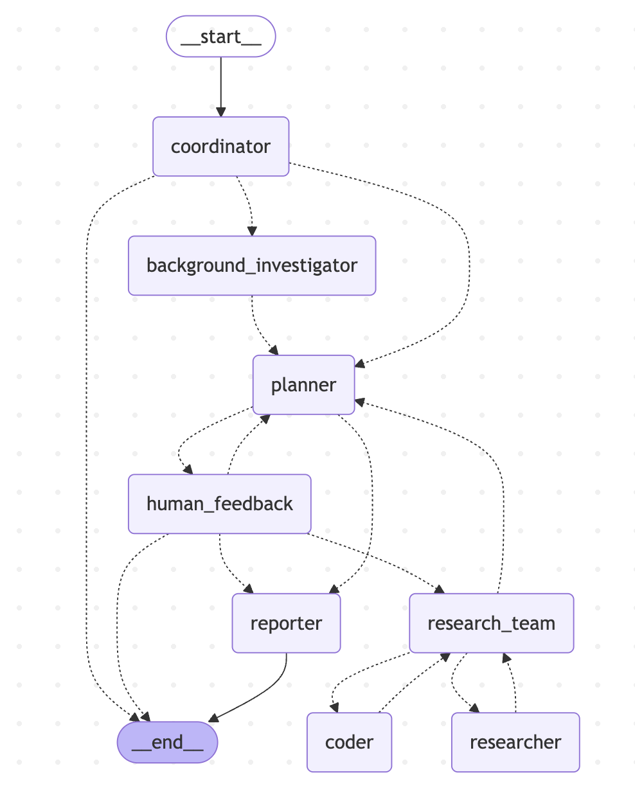

# Learn Agent 

## Graph Architecture


## Test Text to speech
```
import requests
import os

url = "http://localhost:8000/generate_audio/"

# Define the payload
payload = {
    "text_input": "[S1] Dia is an open weights text to dialogue model. [S2] Try it now on GitHub or Hugging Face.",
    "max_new_tokens": 3072,
    "cfg_scale": 3.0,
    "temperature": 1.3,
    "top_p": 0.95,
    "cfg_filter_top_k": 30,
    "speed_factor": 0.94
}

# Optional: Include an audio prompt
files = {}
audio_prompt_path = "./example_prompt.mp3"  # Replace with actual path
if os.path.exists(audio_prompt_path):
    files["audio_prompt"] = open(audio_prompt_path, "rb")

# Send the request
response = requests.post(url, data=payload, files=files)

# Save the output audio
if response.status_code == 200:
    with open("generated_audio.wav", "wb") as f:
        f.write(response.content)
    print("Audio saved as generated_audio.wav")
else:
    print(f"Error: {response.status_code}, {response.text}")

# Cleanup
if "audio_prompt" in files:
    files["audio_prompt"].close()


#Show audio
from IPython.display import Audio

# Đường dẫn tới file âm thanh
audio_file = "generated_audio.wav"

# Phát file âm thanh
Audio(audio_file)
```

## Speech to Text
```
import requests

# URL of the FastAPI server
url = "http://localhost:8001/transcribe/"

# Path to a sample audio file (replace with your own WAV or FLAC file)
audio_file_path = "generated_audio.wav"

# Test with text output
with open(audio_file_path, "rb") as audio_file:
    files = {"file": (audio_file_path, audio_file, "audio/wav")}
    response = requests.post(url, files=files, params={"output_format": "text"})

if response.status_code == 200:
    print("Text Response:", response.json())
else:
    print("Error:", response.json())

# Test with CSV output
with open(audio_file_path, "rb") as audio_file:
    files = {"file": (audio_file_path, audio_file, "audio/wav")}
    response = requests.post(url, files=files, params={"output_format": "csv"})

if response.status_code == 200:
    print("CSV Response:", response.json())
else:
    print("Error:", response.json())

# Test with SRT output
with open(audio_file_path, "rb") as audio_file:
    files = {"file": (audio_file_path, audio_file, "audio/wav")}
    response = requests.post(url, files=files, params={"output_format": "srt"})

if response.status_code == 200:
    print("SRT Response:", response.json())
else:
    print("Error:", response.json())

## OUPUT
Text Response: {'transcription': 'DIA is an open weights text-to-dialog model.', 'word_timestamps': [{'word': 'DIA', 'start_offset': 70, 'end_offset': 77, 'start': 5.6000000000000005, 'end': 6.16}, {'word': 'is', 'start_offset': 79, 'end_offset': 80, 'start': 6.32, 'end': 6.4}, {'word': 'an', 'start_offset': 80, 'end_offset': 81, 'start': 6.4, 'end': 6.48}, {'word': 'open', 'start_offset': 81, 'end_offset': 82, 'start': 6.48, 'end': 6.5600000000000005}, {'word': 'weights', 'start_offset': 85, 'end_offset': 90, 'start': 6.8, 'end': 7.2}, {'word': 'text-to-dialog', 'start_offset': 90, 'end_offset': 100, 'start': 7.2, 'end': 8.0}, {'word': 'model.', 'start_offset': 102, 'end_offset': 108, 'start': 8.16, 'end': 8.64}]}
CSV Response: {'transcription': 'DIA is an open weights text-to-dialog model.', 'csv': 'start,end,word\r\n5.6000000000000005,6.16,DIA\r\n6.32,6.4,is\r\n6.4,6.48,an\r\n6.48,6.5600000000000005,open\r\n6.8,7.2,weights\r\n7.2,8.0,text-to-dialog\r\n8.16,8.64,model.\r\n'}
SRT Response: {'transcription': 'DIA is an open weights text-to-dialog model.', 'srt': '1\n00:00:05,600 --> 00:00:08,640\nDIA is an open weights text-to-dialog model.\n\n'}
```


## Test workflow
```
RUN: python main.py

Enter your query: MCP là gì
2025-05-28 23:02:08 | INFO     | src.workflow | Starting async workflow with user input: MCP là gì
================================ Human Message =================================

MCP là gì
2025-05-28 23:02:08 | INFO     | src.graph.nodes.coordinator | Coordinator talking.
2025-05-28 23:02:09 | INFO     | httpx | HTTP Request: POST https://ivysymintegration-openai-eastus-dev.openai.azure.com/openai/deployments/ivysymintegration-gpt-4o/chat/completions?api-version=2024-08-01-preview "HTTP/1.1 200 OK"
2025-05-28 23:02:09 | INFO     | src.graph.nodes.planner | Planner generating full plan
2025-05-28 23:02:14 | INFO     | httpx | HTTP Request: POST https://ivysymintegration-openai-eastus-dev.openai.azure.com/openai/deployments/ivysymintegration-gpt-4o/chat/completions?api-version=2024-08-01-preview "HTTP/1.1 200 OK"
2025-05-28 23:02:14 | INFO     | src.graph.nodes.planner | Planner response: {
    "locale": "vi-VN",
    "has_enough_context": false,
    "thought": "Người dùng muốn tìm hiểu về MCP, nhưng chưa cung cấp đủ thông tin để xác định chính xác ngữ cảnh hoặc lĩnh vực liên quan. MCP có thể là viết tắt của nhiều thuật ngữ trong các lĩnh vực khác nhau như công nghệ, kinh doanh, y tế, giáo dục, v.v. Cần thu thập thêm thông tin để đảm bảo hiểu rõ và cung cấp câu trả lời toàn diện.",
    "title": "Tìm hiểu về MCP",
    "steps": [
        {
            "need_web_search": true,
            "title": "Xác định các nghĩa phổ biến của MCP",
            "description": "Thu thập thông tin về các nghĩa phổ biến của MCP trong các lĩnh vực khác nhau như công nghệ, kinh doanh, y tế, giáo dục, và các ngành khác. Bao gồm cả các định nghĩa, ứng dụng, và ví dụ cụ thể.",
            "step_type": "research"
        },
        {
            "need_web_search": true,
            "title": "Phân tích MCP trong ngữ cảnh công nghệ",
            "description": "Tìm hiểu MCP có thể là viết tắt của thuật ngữ nào trong lĩnh vực công nghệ, ví dụ như 'Microsoft Certified Professional' hoặc các khái niệm khác. Thu thập thông tin về vai trò, ý nghĩa, và ứng dụng của MCP trong ngành này.",
            "step_type": "research"
        },
        {
            "need_web_search": true,
            "title": "Phân tích MCP trong các lĩnh vực khác",
            "description": "Tìm hiểu MCP có thể được sử dụng trong các lĩnh vực khác như kinh doanh, y tế, giáo dục, hoặc các ngành công nghiệp khác. Thu thập thông tin về cách MCP được định nghĩa và áp dụng trong các ngữ cảnh này.",
            "step_type": "research"
        }
    ]
}
================================== Ai Message ==================================
Name: planner

{
    "locale": "vi-VN",
    "has_enough_context": false,
    "thought": "Người dùng muốn tìm hiểu về MCP, nhưng chưa cung cấp đủ thông tin để xác định chính xác ngữ cảnh hoặc lĩnh vực liên quan. MCP có thể là viết tắt của nhiều thuật ngữ trong các lĩnh vực khác nhau như công nghệ, kinh doanh, y tế, giáo dục, v.v. Cần thu thập thêm thông tin để đảm bảo hiểu rõ và cung cấp câu trả lời toàn diện.",
    "title": "Tìm hiểu về MCP",
    "steps": [
        {
            "need_web_search": true,
            "title": "Xác định các nghĩa phổ biến của MCP",
            "description": "Thu thập thông tin về các nghĩa phổ biến của MCP trong các lĩnh vực khác nhau như công nghệ, kinh doanh, y tế, giáo dục, và các ngành khác. Bao gồm cả các định nghĩa, ứng dụng, và ví dụ cụ thể.",
            "step_type": "research"
        },
        {
            "need_web_search": true,
            "title": "Phân tích MCP trong ngữ cảnh công nghệ",
            "description": "Tìm hiểu MCP có thể là viết tắt của thuật ngữ nào trong lĩnh vực công nghệ, ví dụ như 'Microsoft Certified Professional' hoặc các khái niệm khác. Thu thập thông tin về vai trò, ý nghĩa, và ứng dụng của MCP trong ngành này.",
            "step_type": "research"
        },
        {
            "need_web_search": true,
            "title": "Phân tích MCP trong các lĩnh vực khác",
            "description": "Tìm hiểu MCP có thể được sử dụng trong các lĩnh vực khác như kinh doanh, y tế, giáo dục, hoặc các ngành công nghiệp khác. Thu thập thông tin về cách MCP được định nghĩa và áp dụng trong các ngữ cảnh này.",
            "step_type": "research"
        }
    ]
}
2025-05-28 23:02:14 | INFO     | src.graph.nodes.research_team | Research team is collaborating on tasks.
2025-05-28 23:02:14 | INFO     | src.graph.nodes.researcher | Researcher node is researching.
2025-05-28 23:02:14 | INFO     | src.graph.nodes.utils | Executing step: Xác định các nghĩa phổ biến của MCP
2025-05-28 23:02:14 | INFO     | src.graph.nodes.utils | Recursion limit set to: 30
2025-05-28 23:02:16 | INFO     | httpx | HTTP Request: POST https://ivysymintegration-openai-eastus-dev.openai.azure.com/openai/deployments/ivysymintegration-gpt-4o/chat/completions?api-version=2024-08-01-preview "HTTP/1.1 200 OK"
async [
  {
    "type": "page",
    "title": "MCP là gì? Đơn giản hóa tích hợp AI với Model Context Protocol",
    "url": "https://base.vn/blog/model-context-protocol-mcp-la-gi/",
    "content": "Đi sâu hơn, MCP thực chất là một giao thức nguồn mở (open-source protocol), được thiết kế để kết nối các mô hình/trợ lý AI với các nguồn dữ liệu như CRM, Slack hoặc development server trong doanh nghiệp một cách an toàn và bảo mật. Điều này đồng nghĩa với việc mô hình AI có thể thu thập dữ liệu liên quan và kích hoạt hành động trên các công cụ đó, ví dụ như cập nhật hồ sơ khách hàng, gửi tin nhắn, hoặc khởi chạy quy trình công việc mới. [...] MCP là viết tắt của Model Context Protocol, hay còn gọi là Giao thức ngữ cảnh mô hình. Bạn có thể hình dung MCP như một cầu nối giao tiếp hai chiều giữa mô hình AI và các công cụ, dịch vụ và nguồn dữ liệu bên thứ ba. MCP giúp mô hình AI truy cập dữ liệu, hiểu rõ hơn về ngữ cảnh, từ đó phản hồi yêu cầu của người dùng chính xác và thông minh hơn.",
    "score": 0.6773251,
    "raw_content": "Base Blog\n\nMCP là gì? Đơn giản hóa tích hợp AI với Model Context Protocol\n\nTrước đây, việc kết nối trí tuệ nhân tạo (AI) với các công cụ, ứng dụng hoặc cơ sở dữ liệu bên thứ ba thường yêu cầu viết code tùy chỉnh, sử dụng plugin cho từng nguồn dữ liệu hoặc API riêng biệt. Điều này gây ra không ít khó khăn và bất cập. Do đó, để đơn giản hóa, vào tháng 11/2024, Anthropic đã phát hành Model Context Protocol (MCP) – một giao thức mã nguồn mở giúp AI truy cập nhiều nguồn ngữ cảnh khác nhau một cách thuận tiện và dễ dàng hơn.\n\nVậy MCP là gì và tại sao nó quan trọng cho việc tích hợp AI vào các công cụ mà chúng ta đang sử dụng? Nếu bạn là developer, chuyên gia dữ liệu, hay chỉ đơn thuần yêu thích AI và muốn tối ưu hóa quy trình công việc cho doanh nghiệp mình, bài viết này của Base.vn sẽ là bệ phóng lý tưởng để bạn bắt đầu thử nghiệm MCP.\n\nMục lục\n\n1. MCP là gì?\n\nMCP là viết tắt của Model Context Protocol, hay còn gọi là Giao thức ngữ cảnh mô hình. Bạn có thể hình dung MCP như một cầu nối giao tiếp hai chiều giữa mô hình AI và các công cụ, dịch vụ và nguồn dữ liệu bên thứ ba. MCP giúp mô hình AI truy cập dữ liệu, hiểu rõ hơn về ngữ cảnh, từ đó phản hồi yêu cầu của người dùng chính xác và thông minh hơn.\n\nĐi sâu hơn, MCP thực chất là một giao thức nguồn mở (open-source protocol), được thiết kế để kết nối các mô hình/trợ lý AI với các nguồn dữ liệu như CRM, Slack hoặc development server trong doanh nghiệp một cách an toàn và bảo mật. Điều này đồng nghĩa với việc mô hình AI có thể thu thập dữ liệu liên quan và kích hoạt hành động trên các công cụ đó, ví dụ như cập nhật hồ sơ khách hàng, gửi tin nhắn, hoặc khởi chạy quy trình công việc mới.\n\nCòn nếu hiểu đơn giản hơn, bạn có thể tưởng tượng MCP giống như một cổng USB-C, nhưng dành cho các mô hình AI. Cũng như cách USB-C giúp bạn kết nối dễ dàng nhiều thiết bị khác nhau với máy tính của mình, MCP đơn giản hóa cách các mô hình AI tương tác với dữ liệu, công cụ và dịch vụ mà bạn đang sử dụng.\n\nÝ tưởng về MCP ban đầu được phát triển bởi Anthropic (công ty đứng sau chatbot Claude AI), nhưng hiện tại cũng đã được OpenAI cùng nhiều nền tảng AI khác như Zapier, Replit, Sourcegraph và Windsurf tích cực áp dụng.\n\nĐọc thêm: Công nghệ AI là gì? Ứng dụng trí tuệ nhân tạo AI trong doanh nghiệp\n\n2. Tại sao MCP lại quan trọng đối với các mô hình AI? Lợi ích của Model Context Protocol\n\nNếu không có MCP, các mô hình AI chỉ có thể sử dụng những gì chúng học được trong quá trình đào tạo. Điều này có nghĩa là chúng không thể:\n\nKhi đó, MCP giúp khắc phục những hạn chế này bằng cách tạo điều kiện để các mô hình AI kết nối với các công cụ và dịch vụ bên thứ ba dễ dàng hơn. Nhờ vậy, từ một hệ thống tách biệt, các mô hình AI có thể trở thành ứng dụng mang tính kết nối, có thể giải quyết các vấn đề phức tạp của người dùng.\n\nTheo đó, MCP mang lại cho người dùng, nhất là các doanh nghiệp, 5 lợi ích chính:\n\nMột ví dụ để dễ hình dung:\n\nCó thể thấy, nếu không có MCP, mỗi bước trong quy trình trên sẽ yêu cầu code tùy chỉnh và tích hợp riêng biệt. Nhưng nhờ có MCP, đây là quy trình chuẩn mà bất kỳ hệ thống AI nào cũng có thể áp dụng. Với MCP, việc kết nối và tương tác giữa AI và các công cụ bên ngoài trở nên đơn giản và thuận tiện hơn bao giờ hết!\n\n3. Model Context Protocol (MCP) hoạt động như thế nào?\n\nMCP giúp các developer thiết lập một khuôn khổ tiêu chuẩn cho cách hệ thống AI tương tác với toàn bộ hệ sinh thái công cụ, dịch vụ và nguồn dữ liệu của doanh nghiệp. Nói cách khác, thay vì phải xây dựng từng tích hợp riêng lẻ cho mỗi công cụ hay dịch vụ, MCP cung cấp cách thức chuẩn để hệ thống AI giao tiếp, từ cách gửi yêu cầu, khai thác tính năng, đến cách khám phá tài nguyên.\n\nMCP vận hành dựa trên mô hình client–host–server, cho phép các ứng dụng kết nối cùng lúc với nhiều tài nguyên khác nhau. Cấu trúc này bao gồm 3 thành phần chính:\n\n– MCP Host: Thường là chatbot, IDE hoặc công cụ AI khác, đóng vai trò như bộ điều phối trung tâm trong ứng dụng. Host chịu trách nhiệm quản lý từng phiên Client, kiểm soát quyền truy cập và chính sách bảo mật. Tùy theo cách cấu hình, Host có thể chủ động thực hiện các lệnh thông qua MCP, dựa trên yêu cầu của người dùng hoặc quy trình tự động.\n\n– MCP Client: Có thể là ứng dụng di động hoặc web, được khởi tạo bởi MCP Host. Client kết nối với một Server duy nhất và xử lý giao tiếp hai chiều giữa Host và Server.\n\n– MCP Server: Kết nối với các nguồn dữ liệu hoặc công cụ (cục bộ hoặc từ xa) và cung cấp các khả năng cụ thể. Ví dụ, một MCP Server kết nối với ứng dụng lưu trữ tệp (như Google Drive) có thể cung cấp các chức năng như “tìm kiếm tệp” hoặc “đọc tệp”. Trong khi đó, một MCP Server kết nối với nền tảng trò chuyện nhóm (như Slack) có thể cung cấp các chức năng như “nhận thông tin đề cập mới nhất” hoặc “cập nhật trạng thái cá nhân”.\n\nNgoài ra, Anthropic cũng đã phát hành sẵn danh sách các MCP Server mẫu để bạn có thể sử dụng ngay, hoặc nếu bạn là developer, bạn hoàn toàn có thể tự xây dựng MCP Server phù hợp với nhu cầu của mình.\n\nĐáng chú ý, MCP Server có thể cung cấp dữ liệu cho mô hình AI thông qua 3 phương thức cơ bản:\n\n– Prompt: Các mẫu lệnh được xác định trước cho mô hình ngôn ngữ lớn (Large Language Model – LLM), có thể sử dụng dễ dàng thông qua lệnh gạch chéo (hay slash command, chẳng hạn như /search), menu lựa chọn, v.v…\n\n– Source: Dữ liệu có cấu trúc như tệp, cơ sở dữ liệu hoặc lịch sử hoạt động, giúp bổ sung ngữ cảnh cho LLM.\n\n– Tool: Các hàm (functions) cho phép mô hình thực hiện hành động, ví dụ như gọi API hoặc ghi dữ liệu vào tệp.\n\nMặc dù nhìn bên ngoài, MCP có vẻ khá giống với cách hoạt động của API, nhưng thực tế chúng có sự khác biệt rõ rệt về thiết kế, mục đích và tính linh hoạt.\n\nAPI thường là giao thức trực tiếp và chuyên biệt cho từng công cụ cụ thể. Trong khi đó, MCP được thiết kế như một khuôn khổ tổng quát, giúp mô hình AI khám phá và tương tác với nhiều công cụ và cơ sở dữ liệu một cách thống nhất.\n\nNhiều MCP Server vẫn sử dụng API ở lớp bên dưới, khi kích hoạt thông qua MCP. Tuy nhiên, MCP và API không giống nhau, và sự khác biệt giữa chúng sẽ được làm sáng tỏ ngay sau đây.\n\n4. MCP và API truyền thống: Sự khác biệt là gì?\n\n4.1 So sánh MCP và API truyền thống\n\nTrước đây, để kết nối hệ thống AI với các công cụ bên thứ ba, các developer thường phải tích hợp thủ công từng API riêng lẻ. Mỗi API lại đi kèm với bộ code riêng, tài liệu hướng dẫn riêng, cách xác thực, xử lý lỗi và quy trình bảo trì riêng.\n\nHiểu theo nghĩa bóng, API truyền thống giống như những cánh cửa riêng biệt, mỗi cánh cần một chiếc chìa khóa tùy chỉnh do developer tự tay thiết kế. Chẳng hạn, nếu muốn tích hợp trợ lý AI với Gmail, Google Drive hay Google Calendar, developer phải xây dựng từng chìa khóa (tích hợp) riêng biệt cho từng ứng dụng này.\n\nTrong khi đó, như chúng ta đã thấy, MCP mang đến một cách tiếp cận hoàn toàn khác biệt và tiện lợi hơn. Sự khác biệt giữa MCP và API truyền thống nằm ở 3 điểm cơ bản:\n\n– Giao thức đơn, thống nhất (Single protocol): MCP hoạt động như một “bộ kết nối tiêu chuẩn”. Chỉ cần tích hợp MCP một lần, mô hình AI có thể truy cập đồng loạt vào nhiều công cụ và dịch vụ khác nhau, thay vì chỉ một.\n\n– Khả năng khám phá động (Dynamic discovery): Với MCP, AI có thể tự động phát hiện và tương tác với các công cụ có sẵn mà không cần phải lập trình cứng từng tích hợp ngay từ đầu.\n\n– Giao tiếp hai chiều (Two-way communication): MCP hỗ trợ giao tiếp hai chiều liên tục, theo thời gian thực. Nhờ đó, mô hình AI có thể vừa truy xuất thông tin, vừa kích hoạt hành động trên các ứng dụng hay dịch vụ bên thứ ba.\n\nTiêu chí | MCP | API truyền thống\nKhả năng tích hợp | Giao thức đơn, thống nhất | Tích hợp riêng lẻ trên mỗi API\nGiao tiếp theo thời gian thực | Có | Không\nKhả năng khám phá động | Có | Không\nKhả năng mở rộng | Dễ dàng, thuận tiện | Đòi hỏi các tính hợp bổ trợ\nBảo mật & Kiểm soát | Đảm bảo nhất quán trên tất cả các công cụ | Tùy theo cơ chế của mỗi API\nVậy, tạo sao cần đến giao tiếp 2 chiều?\n\nGiao tiếp 2 chiều theo thời gian thực là một trong những điểm mạnh nổi trội nhất của MCP. Nhờ khả năng này, MCP cho phép các mô hình AI hoặc LLM có thể vừa “kéo” thông tin về, vừa “đẩy” hành động ngược lại Server. Cụ thể:\n\n– Kéo dữ liệu (Pull): Mô hình AI có thể truy vấn server để lấy thông tin ngữ cảnh cần thiết, chẳng hạn như kiểm tra lịch làm việc (calendar) của người dùng.\n\n– Kích hoạt hành động (Push): Mô hình không chỉ đọc dữ liệu mà còn có thể ra lệnh cho server thực hiện tác vụ cụ thể, chẳng hạn như tự động lên lịch một cuộc họp hoặc gửi email cho ai đó.\n\n4.2 Trường hợp nào nên sử dụng MCP thay cho API truyền thống?\n\nDưới đây là một số tình huống ví dụ giúp bạn hình dung rõ hơn việc lựa chọn giữa MCP và API:\n\n– Lập kế hoạch đi công tác:\n\n– IDE thông minh (Trình chỉnh sửa code nâng cao):\n\n– Phân tích dữ liệu phức tạp:\n\n4.3 Khi nào API truyền thống là lựa chọn lý tưởng hơn?\n\nNếu ưu tiên của bạn là khả năng tương tác chính xác, dễ dự đoán và vận hành trong những giới hạn nhất định, thì API truyền thống sẽ là giải pháp phù hợp hơn.\n\nTrong khi MCP mang đến sự linh hoạt và khả năng nhận thức ngữ cảnh sâu sắc, nó có thể không phải là lựa chọn tối ưu cho những hệ thống cần kiểm soát chặt chẽ và hành vi được xác định rõ ràng.\n\nVí dụ: Một ứng dụng ngân hàng trực tuyến thường yêu cầu thực hiện các giao dịch như kiểm tra số dư, chuyển khoản, thanh toán hóa đơn với độ chính xác và bảo mật cực kỳ cao.\n\nTrong trường hợp này, sử dụng API truyền thống để tích hợp AI là thích hợp hơn, vì:\n\nĐọc thêm: AI Agent là gì? Ứng dụng của AI Agent trong doanh nghiệp\n\n5. Muốn triển khai Model Context Protocol (MCP) thì nên bắt đầu từ đâu?\n\nCách tốt nhất để bắt đầu là tham khảo tài liệu và kho lưu trữ MCP chính thức. Anthropic đã mã nguồn mở toàn bộ thông số kỹ thuật và cung cấp sẵn các SDK (hỗ trợ Python, Java và một số ngôn ngữ phổ biến khác). Các bước triển khai cơ bản như sau:\n\nBước 1: Cài đặt hoặc chạy MCP Server cho công cụ bạn muốn kết nối\n\nAnthropic cung cấp sẵn các server mã nguồn mở cho nhiều hệ thống phổ biến như Google Drive, Slack, Git, hoặc cơ sở dữ liệu như Postgres. Bạn chỉ cần cài đặt và cấu hình, thường là chạy một lệnh đơn giản kèm theo thông tin xác thực hoặc khóa truy cập.\n\nBước 2: Thiết lập MCP Client trong mô hình AI\n\nBước 3: Kích hoạt MCP trong Client để nhận thêm tính năng\n\nKhi MCP đã được bật, mô hình AI của bạn sẽ tự động nhận diện và sử dụng thêm các công cụ, tài nguyên và mẫu prompt hỗ trợ từ server.\n\nBước 4: Kích hoạt và kiểm thử\n\nBây giờ, mô hình hoặc tác nhân AI của bạn đã có thể gọi các hành động thông qua MCP Server bất cứ khi nào cần. Ngoài ra, bạn nên theo dõi log để kiểm tra các yêu cầu gửi đi và phản hồi nhận về để đảm bảo quá trình kết nối đang diễn ra đúng mong muốn.\n\n6. Tạm kết\n\nQua những chia sẻ về MCP là gì, Base.vn hy vọng đã giúp bạn đọc hiểu rõ hơn về cách vận hành, lợi ích và ứng dụng của Model Context Protocol trong hệ sinh thái AI. MCP không phải là một API khác; nó là một khuôn khổ kết nối linh động hơn, cho phép các công cụ AI thấu hiểu ngữ cảnh sâu sắc hơn và đưa ra phản hồi chính xác hơn.\n\nVà chúng ta hãy cùng chờ xem, liệu trong tương lai gần, MCP có thể trở thành tiêu chuẩn giao diện mặc định cho các tương tác AI-to-tool, đa phương thức và tích hợp sâu hơn nữa hay không. Hành trình này chỉ mới bắt đầu, những ý tưởng đột phá hơn vẫn đang chờ ở phía trước.\n\nChuyển đổi số đang tạo ra những thay đổi sâu sắc trong tất cả các lĩnh vực đời sống, từ kinh tế, giáo dục đến chính trị và môi trường,\n\nChuyển đổi số đã và đang tạo ra những biến chuyển lớn trong mọi lĩnh vực, ngành nghề, và báo chí, truyền thông cũng không đứng ngoài xu hướng đó.\n\nTrong những năm gần đây, LLM hay mô hình ngôn ngữ lớn có lẽ đã không còn là khái niệm xa lạ, đặc biệt với những ai quan tâm đến\n\nBase © 2017 All Rights Reserved | Privacy Policy\n\nNhận tư vấn miễn phí\n\nNhận tư vấn miễn phí từ các Chuyên gia Chuyển đổi số của chúng tôi\n\n\"Bật mí\" cách để bạn tăng tốc độ vận hành, tạo đà tăng trưởng cho doanh nghiệp của mình với nền tảng quản trị toàn diện Base.vn\n\nThis will close in  2000 seconds\n\n\n\n"
  },
  {
    "type": "page",
    "title": "Model Context Protocol (MCP) là gì? | 200Lab Blog",
    "url": "https://200lab.io/blog/model-context-protocol-mcp-la-gi/",
    "content": "Model Context Protocol (MCP) là một tiêu chuẩn chung, mã nguồn mở được thiết kế để kết nối các hệ thống AI với nhiều nguồn dữ liệu khác nhau, giúp các công cụ AI tạo ra phản hồi chính xác và phù hợp với ngữ cảnh hơn.\n\nGiao thức này khắc phục những hạn chế do tích hợp dữ liệu phân mảnh gây ra bằng cách cung cấp cho các nhà phát triển một kiến trúc thống nhất thông qua các  MCP servers và clients, cùng với các trình kết nối được xây dựng sẵn cho các hệ thống phổ biến như Google Drive và GitHub.",
    "score": 0.6680367,
    "raw_content": "Model Context Protocol (MCP) là gì?\n\n23 Feb, 2025\n\nViệt Trần\n\nModel Context Protocol (MCP) là một tiêu chuẩn chung, mã nguồn mở được thiết kế để kết nối các hệ thống AI với nhiều nguồn dữ liệu khác nhau, giúp các công cụ AI tạo ra phản hồi chính xác và phù hợp với ngữ cảnh hơn.\n\nMục Lục\n\nNgày 25/10/2024, Anthropic đã open-source MCP, một giao thức tiêu chuẩn dùng để kết nối và tăng sức mạnh cho các LLMs một cách mượt mà. Họ ví von việc sử dụng MCP giống như là chúng ta cắm \"USB vào LLMs\", ám chỉ việc dễ dàng \"tháo lắp\". Vậy MCP là gì, chúng ta sẽ cùng tìm hiểu về nó trong bài viết này nhé.\n\n1. Model Context Protocol (MCP) là gì\n\nModel Context Protocol (MCP) là một tiêu chuẩn chung, mã nguồn mở được thiết kế để kết nối các hệ thống AI với nhiều nguồn dữ liệu khác nhau, giúp các công cụ AI tạo ra phản hồi chính xác và phù hợp với ngữ cảnh hơn.\n\nGiao thức này khắc phục những hạn chế do tích hợp dữ liệu phân mảnh gây ra bằng cách cung cấp cho các nhà phát triển một kiến trúc thống nhất thông qua các  MCP servers và clients, cùng với các trình kết nối được xây dựng sẵn cho các hệ thống phổ biến như Google Drive và GitHub.\n\nSáng kiến này nhấn mạnh sự hợp tác và khả năng mở rộng, mời gọi các nhà phát triển, doanh nghiệp và những người đam mê mã nguồn mở tham gia vào việc xây dựng một hệ sinh thái AI tích hợp và nhận thức ngữ cảnh tốt hơn.\n\n2. Kiến trúc tổng quát của MCP\n\n3. Hướng dẫn xây dựng MCP Server với Cloudflare Workers\n\nSau đây mình sẽ hướng dẫn các bạn tự tạo và deploy một MCP Server cực kỳ đơn giản với Cloudflare Workers.\n\n3.1 Cài đặt Claude Desktop app\n\nVì hướng dẫn sau đây sẽ deploy và tích hợp MCP Server vào Claude App vì thế bạn cần cài đặt nếu chưa có nhé. Link cài đặt tại đây.\n\nBạn có thể đăng nhập Claude App bằng bất kỳ một tài khoản FREE nào cũng được.\n\n3.2 Tạo MCP server với TypeScript và Cloudflare workers\n\nVì thói quen sử dụng pnpm làm package manager nên mình sẽ dùng nó thay cho npm. Nếu bạn đang sử dụng npm chỉ cần thay đổi lại câu lệnh:\n\n3.2.1 Khởi tạo dự án Cloudflare worker\n\nMở terminal và chạy câu lệnh dưới đây để khởi tạo dự án:\n\nTiếp theo  chương trình sẽ hỏi bạn vài thứ cơ bản. Trong hướng dẫn này, mình sẽ chọn như sau:\n\nTới đây chúng ta sẽ có một project được khởi tạo với tên là my-hello-mcp.\n\n3.2.2 Cài đặt workers-mcp và deploy lên Cloudflare Workers\n\nTiếp theo chúng ta chạy tiếp câu lệnh sau để deploy MCP server lên Cloudflare:\n\nTới bước này rất có thể các bạn sẽ gặp lỗi giống như mình ở trên. Vì là lần đầu bạn sử dụng wrangler để deploy lên Cloudflare thế nên sẽ cần cung cấp Cloudflare API Key.\n\nCác bạn có thể theo hướng dẫn từ console để làm tiếp hoặc làm theo cách sau đây sẽ tiện hơn:\n\nTới đây thì MCP Server sẽ được deploy và có đường link: https://my-hello-mcp.core-f0d.workers.dev\n\n3.3.3 Cấu hình sử dụng MCP Server với Claude App\n\nChạy tiếp câu lệnh sau:\n\nCâu lệnh sẽ tự động tạo và thêm cấu hình MCP Server vào Claude đại khai như sau:\n\n3.2.4 Sử dụng MCP trong Claude App\n\nOK bây giờ chúng ta thử tắt và mở lại app Claude. Chỗ nhập Prompt sẽ có icon cây búa nho nhỏ ở góc dưới bên phải kèm theo số đếm (hiện tại là 1). Các bạn có thể click vào và xem thử nó là gì:\n\nĐể thử nghiệm, các bạn có thể Promp một câu đại loại như: \"Hello\" hoặc \"Hello, bạn có thể sử dụng mcp để chào lại mình không?\"\n\nChương trình sẽ xuất hiện một popup xin quyền thực thi MCP. Các bạn có thể cho phép nó chạy hoặc không. Vì thế mình sẽ chọn \"Allow for this chat\".\n\nTới đây chúng ta sẽ thấy Claude sẽ gọi MCP Server và lấy kết quả để tạo ra một Prompt tiếp theo, sau đó mới phản hồi. Và đây chính là cách các MCP hoạt động.\n\nTrên thực tế, với các MCP phức tạp hơn, nó có thể làm được nhiều thứ hơn và có thể các MCP có thể cùng liên kết lại để giải quyết một yêu cầu phức tạp từ người dùng.\n\nNếu bạn thắc mắc câu \"Hello from an MCP Worker, Việt!\" thì nó đến từ file source code src/index.ts:\n\n4. Kết luận\n\nMCP (Model Context Protocol) là một giải pháp mạnh mẽ để tối ưu hóa việc sử dụng LLMs, đồng thời khuyến khích sự đóng góp và phát triển từ cộng đồng mã nguồn mở. Với MCP chúng ta (dev) có thể dễ dàng phát triển các công cụ giúp tăng cường sức mạnh của các LLMs cũng như góp phần cải thiện Workflow nhanh và chính xác hơn.\n\nBài viết liên quan\n\nLập trình backend ExpressJS\n\nĐăng ký nhận thông báo\n\nĐừng bỏ lỡ những bài viết thú vị từ 200Lab\n\nVề 200Lab\n\n© 2025 200Lab.io. All rights reserved.\n\n"
  },
  {
    "type": "page",
    "title": "Model Context Protocol (MCP): Giao thức tích hợp và mở rộng năng lực ...",
    "url": "https://caodang.fpt.edu.vn/tin-tuc-poly/model-context-protocol-mcp-giao-thuc-tich-hop-va-mo-rong-nang-luc-cho-mo-hinh-ai.html",
    "content": "Model Context Protocol (MCP) là một giao thức thiết kế nhằm mở rộng khả năng của các mô hình ngôn ngữ lớn (LLM) và AI Agent, cho phép chúng tương tác với dữ liệu, công cụ và môi trường bên ngoài một cách hiệu quả. MCP cung cấp một khuôn khổ tiêu chuẩn hóa để bổ sung \"ngữ cảnh\" cho các mô hình AI, vượt qua giới",
    "score": 0.6625569
  },
  {
    "type": "image",
    "image_url": "https://licadho.org/wp-content/uploads/2021/08/imager_1_14586_200.jpg",
    "image_description": "A hand holding a smartphone displays a map with various locations marked, accompanied by a stylized cityscape and text promoting effective sales route optimization."
  },
  {
    "type": "image",
    "image_url": "https://xuyenvietmedia.com/wp-content/uploads/2023/03/chung-chi-mcp-la-gi-0.jpg",
    "image_description": "A person with long braided hair is sitting at a laptop, surrounded by colorful icons representing Microsoft Office applications like Word, Excel, and PowerPoint."
  },
  {
    "type": "image",
    "image_url": "http://xuyenvietmedia.com/wp-content/uploads/2023/03/chung-chi-mcp-la-gi-2.jpg",
    "image_description": "The logo of Microsoft is prominently displayed on the exterior of a modern building against a clear blue sky."
  },
  {
    "type": "image",
    "image_url": "https://cdn.thuvienphapluat.vn/uploads/tintuc/2022/11/08/pho-bien-phap-luat-vn.png",
    "image_description": "A graphic emphasizes the collective responsibility of individuals and organizations in promoting legal education and awareness, featuring two figures holding hands against a backdrop of bold, radiating colors."
  },
  {
    "type": "image",
    "image_url": "https://xuyenvietmedia.com/wp-content/uploads/2023/03/chung-chi-mcp-la-gi-3.jpg",
    "image_description": "A certificate recognizing Jonathan Jansen as a Microsoft Office Specialist Master, indicating his successful completion of several Microsoft Office 2013 applications, signed by Satya Nadella."
  }
]
2025-05-28 23:02:30 | INFO     | httpx | HTTP Request: POST https://ivysymintegration-openai-eastus-dev.openai.azure.com/openai/deployments/ivysymintegration-gpt-4o/chat/completions?api-version=2024-08-01-preview "HTTP/1.1 200 OK"
2025-05-28 23:02:30 | INFO     | src.tools.decorators | Tool crawl_tool called with parameters: url=https://base.vn/blog/model-context-protocol-mcp-la-gi/
2025-05-28 23:02:30 | INFO     | src.tools.decorators | Tool crawl_tool called with parameters: url=https://200lab.io/blog/model-context-protocol-mcp-la-gi/
2025-05-28 23:02:30 | INFO     | src.tools.decorators | Tool crawl_tool called with parameters: url=https://caodang.fpt.edu.vn/tin-tuc-poly/model-context-protocol-mcp-giao-thuc-tich-hop-va-mo-rong-nang-luc-cho-mo-hinh-ai.html
Warning: node executable not found, reverting to pure-Python mode. Install Node.js v10 or newer to use Readability.js.
2025-05-28 23:02:40 | INFO     | src.tools.decorators | Tool crawl_tool returned: {'url': 'https://base.vn/blog/model-context-protocol-mcp-la-gi/', 'crawled_content': '# MCP là gì? Đơn giản hóa tích hợp AI với Model Context Protocol\n\nMCP là gì? Đơn giản hóa tích hợp AI với Model Context Protocol\n\nChuyển đến nội dung\n\nBase Blog\n\nSản phẩm\n\nGiải pháp\n\nKhách hàng\n\nResources\n\nĐăng nhập Đăng ký Demo\n\nBase Work+\n\nQuản trị công việc & hiệu suất\n\nBase Request Quản lý phê duyệt Base Wework Quản lý công việc & dự án Base Workflow Quản lý quy trình Base Square Hỏi đáp & Tri thức Base XSpace Không gian số toàn diện & cá nhân hóa→ Xem thêm ứng dụng khác\n\nBase Info+\n\nQuản trị thông tin & giao tiếp\n\nBase Office Quản lý thông báo & công văn Base Inside Mạng truyền thông nội bộ Base Message Team chat & video call Base Meeting Quản lý Meeting Base Booking Quản lý phòng họp & tài nguyên Base Meetup Event Q&As Base Sign Chữ ký điện tử → Xem thêm ứng dụng khác\n\nBase HRM+\n\nQuản trị & phát triển con người\n\nBase E-Hiring Quản trị tuyển dụng Base HRM Quản trị thông tin nhân sự Base Checkin Quản lý chấm công Base Goal Quản trị mục tiêu Base Square Social learning → Xem thêm ứn'}
Warning: node executable not found, reverting to pure-Python mode. Install Node.js v10 or newer to use Readability.js.
2025-05-28 23:02:47 | INFO     | src.tools.decorators | Tool crawl_tool returned: {'url': 'https://caodang.fpt.edu.vn/tin-tuc-poly/model-context-protocol-mcp-giao-thuc-tich-hop-va-mo-rong-nang-luc-cho-mo-hinh-ai.html', 'crawled_content': "# Model Context Protocol (MCP): Giao thức tích hợp và mở rộng năng lực cho mô hình AI\n\nModel Context Protocol (MCP): Giao thức tích hợp và mở rộng năng lực cho mô hình AI - Cao Đẳng FPT Polytechnic\n\nSkip to content\n\nHome / Đà Nẵng / Hoạt động sinh viên / Poly's Blog / Tin mới nhất / Tin tức Poly\n\nModel Context Protocol (MCP): Giao thức tích hợp và mở rộng năng lực cho mô hình AI\n===================================================================================\n\n17:56 15/05/2025\n\nModel Context Protocol (MCP) là một giao thức thiết kế nhằm mở rộng khả năng của các mô hình ngôn ngữ lớn (LLM) và AI Agent, cho phép chúng tương tác với dữ liệu, công cụ và môi trường bên ngoài một cách hiệu quả. MCP cung cấp một khuôn khổ tiêu chuẩn hóa để bổ sung “ngữ cảnh” cho các mô hình AI, vượt qua giới hạn về kiến thức tĩnh và khả năng xử lý thông tin theo thời gian thực.\n\nMục lục\n\n* 1 Kiến trúc và Nguyên lý Hoạt động\n* 2 Các thành phần chính của MCP\n* 3 Quy trình hoạt động của MCP\n* 4 Sơ đồ kiến trúc "}
Warning: node executable not found, reverting to pure-Python mode. Install Node.js v10 or newer to use Readability.js.
2025-05-28 23:03:04 | INFO     | src.tools.decorators | Tool crawl_tool returned: {'url': 'https://200lab.io/blog/model-context-protocol-mcp-la-gi/', 'crawled_content': '# Model Context Protocol (MCP) là gì?\n\nModel Context Protocol (MCP) là gì? | 200Lab Blog\n\nModel Context Protocol (MCP) là gì?\n===================================\n\n23 Feb, 2025\n\nAI\n\nViệt Trần\n\nAuthor\n\nModel Context Protocol (MCP) là một tiêu chuẩn chung, mã nguồn mở được thiết kế để kết nối các hệ thống AI với nhiều nguồn dữ liệu khác nhau, giúp các công cụ AI tạo ra phản hồi chính xác và phù hợp với ngữ cảnh hơn.\n\n#### Mục Lục\n\n1. 1. Model Context Protocol (MCP) là gì\n2. 2. Kiến trúc tổng quát của MCP\n3. 3. Hướng dẫn xây dựng MCP Server với Cloudflare Workers\n\n   1. 3.1 Cài đặt Claude Desktop app\n   2. 3.2 Tạo MCP server với TypeScript và Cloudflare workers\n4. 4. Kết luận\n\nNgày 25/10/2024, Anthropic đã open-source MCP, một giao thức tiêu chuẩn dùng để kết nối và tăng sức mạnh cho các LLMs một cách mượt mà. Họ ví von việc sử dụng MCP giống như là chúng ta cắm "USB vào LLMs", ám chỉ việc dễ dàng "tháo lắp". Vậy MCP là gì, chúng ta sẽ cùng tìm hiểu về nó trong bài viết này nhé.\n\n1. Model '}
2025-05-28 23:03:18 | INFO     | httpx | HTTP Request: POST https://ivysymintegration-openai-eastus-dev.openai.azure.com/openai/deployments/ivysymintegration-gpt-4o/chat/completions?api-version=2024-08-01-preview "HTTP/1.1 200 OK"
2025-05-28 23:03:18 | INFO     | src.graph.nodes.utils | Step 'Xác định các nghĩa phổ biến của MCP' execution completed by researcher
================================ Human Message =================================
Name: researcher

## Problem Statement

Xác định các nghĩa phổ biến của MCP trong các lĩnh vực khác nhau như công nghệ, kinh doanh, y tế, giáo dục, và các ngành khác. Bao gồm cả các định nghĩa, ứng dụng, và ví dụ cụ thể.

---

## Research Findings

### 1. Nghĩa của MCP trong Công nghệ
- **Model Context Protocol (MCP)**:
  - Là một giao thức mã nguồn mở được thiết kế để kết nối các hệ thống AI với nhiều nguồn dữ liệu khác nhau.
  - MCP giúp các mô hình AI (như LLMs - Large Language Models) tạo ra phản hồi chính xác và phù hợp với ngữ cảnh hơn.
  - Ứng dụng:
    - Tích hợp AI với các công cụ như Google Drive, Slack, GitHub.
    - Tăng cường khả năng xử lý dữ liệu và tương tác thời gian thực.
  - Ví dụ:
    - Một mô hình AI sử dụng MCP có thể tự động lên lịch họp hoặc gửi email thông qua các công cụ tích hợp.

### 2. Nghĩa của MCP trong Kinh doanh
- **Microsoft Certified Professional (MCP)**:
  - Là chứng chỉ chuyên môn của Microsoft dành cho các cá nhân đạt được kỹ năng và kiến thức trong việc sử dụng các sản phẩm và công nghệ của Microsoft.
  - Ứng dụng:
    - Được sử dụng để chứng minh năng lực trong các lĩnh vực như quản trị hệ thống, phát triển phần mềm, và quản lý cơ sở dữ liệu.
  - Ví dụ:
    - Một nhân viên IT có chứng chỉ MCP có thể được ưu tiên tuyển dụng trong các công ty sử dụng hệ thống Microsoft.

### 3. Nghĩa của MCP trong Y tế
- **Metacarpophalangeal Joint (MCP)**:
  - Là thuật ngữ y học chỉ các khớp nối giữa xương bàn tay và xương ngón tay.
  - Ứng dụng:
    - Được sử dụng trong chẩn đoán và điều trị các bệnh lý liên quan đến khớp, như viêm khớp dạng thấp.
  - Ví dụ:
    - Bác sĩ có thể yêu cầu chụp X-quang khớp MCP để đánh giá mức độ tổn thương.

### 4. Nghĩa của MCP trong Giáo dục
- **Master of City Planning (MCP)**:
  - Là bằng thạc sĩ chuyên ngành quy hoạch đô thị.
  - Ứng dụng:
    - Đào tạo các chuyên gia trong lĩnh vực quy hoạch và phát triển đô thị bền vững.
  - Ví dụ:
    - Một sinh viên tốt nghiệp MCP có thể làm việc tại các cơ quan quy hoạch đô thị hoặc tổ chức phi chính phủ.

### 5. Nghĩa của MCP trong Các lĩnh vực khác
- **Multi-Chip Package (MCP)**:
  - Là một công nghệ trong lĩnh vực điện tử, nơi nhiều chip được tích hợp trong một gói duy nhất.
  - Ứng dụng:
    - Sử dụng trong các thiết bị điện tử nhỏ gọn như điện thoại di động và máy tính bảng.
  - Ví dụ:
    - Một smartphone hiện đại có thể sử dụng MCP để tiết kiệm không gian và tăng hiệu suất.

---

## Conclusion

MCP có nhiều nghĩa khác nhau tùy thuộc vào lĩnh vực ứng dụng:
- Trong công nghệ, MCP là một giao thức kết nối AI với các nguồn dữ liệu.
- Trong kinh doanh, MCP là chứng chỉ chuyên môn của Microsoft.
- Trong y tế, MCP là thuật ngữ chỉ khớp nối giữa xương bàn tay và ngón tay.
- Trong giáo dục, MCP là bằng thạc sĩ về quy hoạch đô thị.
- Trong điện tử, MCP là công nghệ tích hợp nhiều chip trong một gói.

---

## References

- [MCP là gì? Đơn giản hóa tích hợp AI với Model Context Protocol](https://base.vn/blog/model-context-protocol-mcp-la-gi/)

- [Model Context Protocol (MCP) là gì? | 200Lab Blog](https://200lab.io/blog/model-context-protocol-mcp-la-gi/)

- [Model Context Protocol (MCP): Giao thức tích hợp và mở rộng năng lực cho mô hình AI](https://caodang.fpt.edu.vn/tin-tuc-poly/model-context-protocol-mcp-giao-thuc-tich-hop-va-mo-rong-nang-luc-cho-mo-hinh-ai.html)
2025-05-28 23:03:18 | INFO     | src.graph.nodes.research_team | Research team is collaborating on tasks.
2025-05-28 23:03:18 | INFO     | src.graph.nodes.researcher | Researcher node is researching.
2025-05-28 23:03:18 | INFO     | src.graph.nodes.utils | Executing step: Phân tích MCP trong ngữ cảnh công nghệ
2025-05-28 23:03:18 | INFO     | src.graph.nodes.utils | Recursion limit set to: 30
2025-05-28 23:03:29 | INFO     | httpx | HTTP Request: POST https://ivysymintegration-openai-eastus-dev.openai.azure.com/openai/deployments/ivysymintegration-gpt-4o/chat/completions?api-version=2024-08-01-preview "HTTP/1.1 200 OK"
2025-05-28 23:03:29 | INFO     | src.graph.nodes.utils | Step 'Phân tích MCP trong ngữ cảnh công nghệ' execution completed by researcher
================================ Human Message =================================
Name: researcher

## Problem Statement

Phân tích MCP trong ngữ cảnh công nghệ, xác định các thuật ngữ mà MCP có thể đại diện, vai trò, ý nghĩa, và ứng dụng của chúng trong ngành công nghệ.

---

## Research Findings

### 1. Model Context Protocol (MCP)
- **Định nghĩa**:
  - MCP là một giao thức mã nguồn mở được thiết kế để kết nối các hệ thống AI với nhiều nguồn dữ liệu khác nhau.
- **Vai trò**:
  - Tăng cường khả năng xử lý dữ liệu và tương tác thời gian thực của các mô hình AI.
  - Hỗ trợ các mô hình AI (như Large Language Models - LLMs) tạo ra phản hồi chính xác và phù hợp với ngữ cảnh.
- **Ứng dụng**:
  - Tích hợp AI với các công cụ như Google Drive, Slack, GitHub.
  - Tự động hóa các tác vụ như lên lịch họp, gửi email, và quản lý dữ liệu.
- **Ví dụ**:
  - Một mô hình AI sử dụng MCP có thể tự động phân tích dữ liệu từ Google Drive và tạo báo cáo.

### 2. Microsoft Certified Professional (MCP)
- **Định nghĩa**:
  - MCP là chứng chỉ chuyên môn của Microsoft dành cho các cá nhân đạt được kỹ năng và kiến thức trong việc sử dụng các sản phẩm và công nghệ của Microsoft.
- **Vai trò**:
  - Chứng minh năng lực chuyên môn trong các lĩnh vực như quản trị hệ thống, phát triển phần mềm, và quản lý cơ sở dữ liệu.
- **Ứng dụng**:
  - Được sử dụng rộng rãi trong ngành công nghệ thông tin để nâng cao cơ hội nghề nghiệp.
- **Ví dụ**:
  - Một kỹ sư phần mềm có chứng chỉ MCP có thể được ưu tiên tuyển dụng trong các công ty sử dụng hệ thống Microsoft.

### 3. Multi-Chip Package (MCP)
- **Định nghĩa**:
  - MCP là một công nghệ trong lĩnh vực điện tử, nơi nhiều chip được tích hợp trong một gói duy nhất.
- **Vai trò**:
  - Giảm kích thước và tăng hiệu suất của các thiết bị điện tử.
- **Ứng dụng**:
  - Sử dụng trong các thiết bị nhỏ gọn như điện thoại di động, máy tính bảng, và các thiết bị IoT.
- **Ví dụ**:
  - Một smartphone hiện đại sử dụng MCP để tiết kiệm không gian và cải thiện hiệu suất xử lý.

---

## Conclusion

Trong ngữ cảnh công nghệ, MCP có thể đại diện cho nhiều thuật ngữ khác nhau, mỗi thuật ngữ có vai trò và ứng dụng riêng:
1. **Model Context Protocol (MCP)**: Giao thức kết nối AI với các nguồn dữ liệu, hỗ trợ xử lý dữ liệu và tương tác thời gian thực.
2. **Microsoft Certified Professional (MCP)**: Chứng chỉ chuyên môn của Microsoft, chứng minh năng lực trong việc sử dụng các sản phẩm công nghệ của hãng.
3. **Multi-Chip Package (MCP)**: Công nghệ tích hợp nhiều chip trong một gói, giúp giảm kích thước và tăng hiệu suất của thiết bị điện tử.

---

## References

- [MCP là gì? Đơn giản hóa tích hợp AI với Model Context Protocol](https://base.vn/blog/model-context-protocol-mcp-la-gi/)

- [Model Context Protocol (MCP) là gì? | 200Lab Blog](https://200lab.io/blog/model-context-protocol-mcp-la-gi/)

- [Model Context Protocol (MCP): Giao thức tích hợp và mở rộng năng lực cho mô hình AI](https://caodang.fpt.edu.vn/tin-tuc-poly/model-context-protocol-mcp-giao-thuc-tich-hop-va-mo-rong-nang-luc-cho-mo-hinh-ai.html)

- [Microsoft Certified Professional (MCP) Overview](https://www.microsoft.com/en-us/learning/mcp-certification.aspx)

- [Multi-Chip Package (MCP) Technology Explained](https://www.electronics-notes.com/articles/electronic_components/semiconductor-packages/multi-chip-package-mcp.php)
2025-05-28 23:03:29 | INFO     | src.graph.nodes.research_team | Research team is collaborating on tasks.
2025-05-28 23:03:29 | INFO     | src.graph.nodes.researcher | Researcher node is researching.
2025-05-28 23:03:29 | INFO     | src.graph.nodes.utils | Executing step: Phân tích MCP trong các lĩnh vực khác
2025-05-28 23:03:29 | INFO     | src.graph.nodes.utils | Recursion limit set to: 30
2025-05-28 23:03:31 | INFO     | httpx | HTTP Request: POST https://ivysymintegration-openai-eastus-dev.openai.azure.com/openai/deployments/ivysymintegration-gpt-4o/chat/completions?api-version=2024-08-01-preview "HTTP/1.1 200 OK"
async [
  {
    "type": "page",
    "title": "Tương lai của MCP và khả năng ứng dụng trong thời đại AI: Chân trời mới ...",
    "url": "https://www.kr-inside.com/2025/04/tuong-lai-cua-mcp-va-kha-nang-ung-dung.html",
    "content": "MCP đóng góp quan trọng trong việc hiện thực hóa trợ lý AI tùy chỉnh trong nhiều ngành công nghiệp. Ví dụ, trong lĩnh vực y tế, AI kết nối với hồ sơ bệnh án điện tử (EMR) và cơ sở dữ liệu y tế để cung cấp lời khuyên chẩn đoán theo thời gian thực cho bác sĩ. Trong lĩnh vực tài chính, AI tổng hợp và phân tích thông tin về giá cả theo thời gian thực, báo cáo nội bộ, và thông tin khách hàng để đưa ra lời khuyên cho các khoản đầu tư.Ngoài ra, AI đóng vai trò như một thư ký công việc cho các doanh",
    "score": 0.75049835,
    "raw_content": "KR-INSIDE는 경제적 자유를 목표로 하며, 주로 부산·울산·경남 지역의 부동산, 개발 정보, 투자 후기, 여행정보 등을 다루고 있습니다.\n\nTương lai của MCP và khả năng ứng dụng trong thời đại AI: Chân trời mới của hạ tầng kết nối\n\nMục lục\n\nTrong khi AI đang thay đổi cuộc sống của chúng ta, MCP đang nổi lên như một công nghệ cốt lõi cho những thay đổi đó. MCP (Model Context Protocol) do Anthropic công bố đang nổi lên như một công nghệ quan trọng cung cấp cấu trúc cho việc kết nối an toàn và linh hoạt giữa AI và dữ liệu bên ngoài. Giao thức này không chỉ đơn thuần là tiêu chuẩn giao diện, mà còn cung cấp nhiều khả năng ứng dụng khác nhau.Dù MCP vẫn còn ở giai đoạn đầu, nhưng tính mở rộng và khả năng ứng dụng của nó có khả năng gây ảnh hưởng lớn đến toàn bộ hệ sinh thái AI. Bài viết này sẽ dự đoán cách mà MCP sẽ phát triển trong tương lai và các lĩnh vực ứng dụng chính của nó.\n\nChuỗi bài viết về MCP và Công nghệ Kết Nối AI\n\nChìa khóa xử lý tài liệu dài và dữ liệu khổng lồ\n\nAI thường gặp khó khăn trong việc xử lý tài liệu khổng lồ hoặc lượng dữ liệu lớn. Tuy nhiên, MCP cung cấp giải pháp để vượt qua những giới hạn này.Ví dụ, AI có thể tiếp cận một phần hàng nghìn trang sách án hoặc hàng trăm bài nghiên cứu để phân tích theo thời gian thực. Nó có thể chọn thông tin phù hợp nhất để trả lời các câu hỏi.Công nghệ này mở ra khả năng thực sự cho 'trợ lý nghiên cứu AI' trong các lĩnh vực như tư vấn pháp luật, hỗ trợ nghiên cứu học thuật và tóm tắt báo cáo tài chính. Sự phát triển này sẽ có tác động tích cực đến nhiều ngành công nghiệp và góp phần nâng cao hiệu quả.\n\nSự phổ biến của trợ lý AI trong lĩnh vực chuyên ngành\n\nMCP đóng góp quan trọng trong việc hiện thực hóa trợ lý AI tùy chỉnh trong nhiều ngành công nghiệp. Ví dụ, trong lĩnh vực y tế, AI kết nối với hồ sơ bệnh án điện tử (EMR) và cơ sở dữ liệu y tế để cung cấp lời khuyên chẩn đoán theo thời gian thực cho bác sĩ. Trong lĩnh vực tài chính, AI tổng hợp và phân tích thông tin về giá cả theo thời gian thực, báo cáo nội bộ, và thông tin khách hàng để đưa ra lời khuyên cho các khoản đầu tư.Ngoài ra, AI đóng vai trò như một thư ký công việc cho các doanh nghiệp, quản lý lịch trình và tích hợp với email, hệ thống quản lý quan hệ khách hàng (CRM) để tự động chuẩn bị cuộc họp, điều chỉnh lịch trình và tóm tắt báo cáo. Chức năng thư ký này tương tự như tính năng Extensions của Google Bard và nhờ vào MCP, nó có thể dễ dàng được áp dụng trên nhiều nền tảng. Trong tương lai, chúng tôi kỳ vọng sẽ có các gói kết nối MCP theo ngành xuất hiện, giúp bất kỳ ai cũng có thể dễ dàng tạo trợ lý AI của riêng mình.\n\nTác nhân AI và quy trình làm việc tự động\n\nKhái niệm về các tác nhân AI tự trị như Auto-GPT và BabyAGI đã được biết đến, nhưng MCP đang trở thành nền tảng để thực sự áp dụng chúng. Ví dụ, một tác nhân AI có thể tự động thực hiện nhiều công việc khi được liên kết với Jira, GitHub, máy chủ kiểm thử, Slack thông qua MCP. Điều này cho phép thu thập báo cáo lỗi, tự động sửa mã liên quan, thực hiện thử nghiệm và báo cáo kết quả trên Slack.Hơn nữa, MCP cũng có thể đóng vai trò trung tâm trong 'phối hợp tác nhân', nơi nhiều tác nhân AI hợp tác để thực hiện các nhiệm vụ. Đây sẽ là một yếu tố quan trọng dẫn đến sự thay đổi mang tính cách mạng trong việc tự động hóa công việc.\n\nSự nâng cao tiêu chuẩn và phát triển hệ sinh thái\n\nCác tiêu chuẩn công nghệ càng có nhiều người sử dụng thì càng mạnh mẽ và hữu ích. MCP cũng đang tham gia vào xu hướng này. Các cải tiến như nâng cao quản lý quyền, thêm nhật ký kiểm tra, hỗ trợ tính năng phản hồi theo thời gian thực đang được công bố và có khả năng sẽ được chấp nhận làm giao thức chính thức bởi các tổ chức tiêu chuẩn quốc tế như W3C và ISO. Trong tương lai, dự kiến sẽ có các kết nối mở rộng MCP đa phương thức bao gồm xử lý hình ảnh và điều khiển IoT. Khi hệ sinh thái MCP ngày càng phong phú, quá trình cung cấp các tính năng mới cho AI sẽ trở nên đơn giản như việc kết nối các thiết bị USB.\n\nThay đổi mô hình thiết kế dịch vụ AI\n\nCác trí tuệ nhân tạo truyền thống chủ yếu đã dựa vào \"mô hình đã học\". Tuy nhiên, nhờ sự phát triển của MCP, \"khả năng kết nối với bên ngoài\" sẽ trở thành lợi thế cạnh tranh thực sự.Ví dụ, nếu một chatbot hỗ trợ khách hàng kết nối không chỉ với cơ sở dữ liệu công ty mà còn với nguồn cấp dữ liệu SNS, hệ thống quản lý tồn kho, và API giao hàng, nó sẽ có khả năng cung cấp dịch vụ thông minh hơn nhiều chứ không chỉ dừng lại ở các câu hỏi thường gặp.Trong tương lai, ngày càng có khả năng các doanh nghiệp sẽ ưu tiên xem xét khả năng tương thích với MCP trước khi triển khai AI. Điều này có thể giống như xu hướng trong quá khứ khi các doanh nghiệp bắt buộc phải xây dựng RESTful API.\n\nMCP có trở thành cơ sở hạ tầng kết nối trong thời đại AI?\n\nTóm lại, MCP không chỉ đơn thuần là một công cụ. Nó đóng vai trò như một mắt xích quan trọng kết nối thế giới AI và con người, đổi mới cách tiếp cận thông tin và đơn giản hóa việc sử dụng công cụ. Hơn nữa, nó đang trở thành yếu tố cốt lõi mở rộng phạm vi tự động hóa và hình thành một hệ sinh thái AI mới.AI trong tương lai sẽ không chỉ giới hạn ở một mô hình đơn lẻ. Thông qua MCP, người dùng có thể truy cập vào ngữ cảnh cần thiết bất cứ lúc nào, dễ dàng sử dụng công cụ và có khả năng hiểu và hành động như con người trong tình huống.Đối với AI, khả năng kết nối và ngữ cảnh là sức mạnh rất quan trọng, và MCP đang định hình thành tiêu chuẩn thực sự cho việc kết nối này. Những thay đổi này sẽ tăng tốc sự phát triển của AI và thâm nhập sâu hơn vào cuộc sống của chúng ta.\n\n#MCP, #Công nghệ tương lai AI, #Trợ lý AI, #AI chuyên ngành, #Tự động hóa AI, #Phối hợp tác nhân, #AutoGPT, #Trợ lý nghiên cứu AI, #Kết nối MCP, #Hệ sinh thái AI, #AI pháp lý, #AI y tế, #AI tài chính, #Thư ký thông minh, #Tiêu chuẩn MCP, #Cơ sở hạ tầng kết nối AI, #Quy trình làm việc AI, #Claude, #Kết nối GPT, #Xu hướng công nghệ AI, #Truy cập dữ liệu AI, #Tóm tắt tài liệu AI, #Tìm kiếm AI, #Tự động hóa công việc AI, #Tiêu chuẩn W3C, #AI đa phương thức, #AI lập trình viên, #Chiến lược AI doanh nghiệp, #AI kết nối, #AI dựa trên ngữ cảnh\n\nAdvertisement\n\nPopular Posts\n\n국토부, 개발제한구역 그린벨트 해제! 비수도권 15개 국가 및 지역 전략사업 발표 - 부산, 대구, 광주, 대전, 울산, 창원 포함\n\n釜山新港-金海高速公路建设工程，计划于2025年下半年开工，预计于2030年完工！总投资额为1.4兆韩元的大型项目介绍。\n\n수영구 남천동, 써밋 리미티드 7월 분양 예정! 평당 5천만원의 매력적인 기회\n\n부산광역시 제2차 도시철도 구축계획: 주요 노선 추진현황 및 개통 전망\n\nRecent Posts\n\nMain Tags\n\nSearch\n\n같이 읽어볼만할 글\n\n板桥换乘设施开工： 서울↔板桥间通勤时间缩短30分钟，开启高速公路连接的新纪元\n\n인기글\n\n문의하기 양식\n\n\n\n\n\n"
  },
  {
    "type": "page",
    "title": "MCP (Mono Calcium Phosphat) - Hóa Chất Trường Phú",
    "url": "https://www.hoachattruongphu.com/mcp-mono-calcium-phosphat.html",
    "content": "MCP thường được sử dụng trong ngành công nghiệp thực phẩm và sản xuất thức ăn chăn nuôi. Chất này được sử dụng để điều chỉnh pH trong thực phẩm và đồ uống. Nó cũng được thêm vào bột nổi để tăng tính bền và khả năng nở của bột. Trong sản xuất thức ăn chăn nuôi, MCP đóng vai trò như một nguồn cung cấp canxi và phốt pho cho động vật.\nBên cạnh đó, MCP cũng được dùng trong ngành công nghiệp hóa chất và làm phân bón. [...] MCP, Mono Calcium Phosphat, là loại khoáng chất giá rẻ được dùng rộng rãi trong ngành sản xuất thức ăn chăn nuôi, thú y, nuôi thủy sản, thực phẩm, dược phẩm, phân bón...\n-\n+\nThêm vào giỏ\nXu hướng tìm kiếm: MCPMonocalcium PhosphatCa(H2PO4)2.H2OMCP là gìMonocalcium phosphat là gì\n\nMô tả\nĐánh giá (0)",
    "score": 0.7211353,
    "raw_content": "MCP (Mono Calcium Phosphat)\n===============\n\nTài Khoản\nĐăng Ký\nĐăng Nhập\n\n\n\n\n\n028 38 31 31 210913 898 494 \n 0913 898 494 \n \n\nXem giỏ hàng\n0 sản phẩm -0 VNĐ\n*   Giỏ Hàng đang trống!\nMenu\n\nTrang chủ\nGiới thiệu\nKhuyến mãi\nSản phẩm mới\nSản phẩm hot\nTin Tức\n\n\n\n\n\n\n\n\n\nMCP (Mono Calcium Phosphat)\n\nTrang chủ\nMCP (Mono Calcium Phosphat)\n\nDANH MỤC SẢN PHẨM\n\nThủy sản\nChăn nuôi thú y\nXử lý nước\nHồ bơi\nPhân bón\nHóa chất công nghiệp\nHóa chất cơ bản\nThực phẩm\nY tế\nDệt nhuộm\nMỹ phẩm\nGỗ, giấy\nXi mạ\nCao su\nXây dựng\nNông nghiệp\nDịch vụ logistic\n\nMới nhất\n\nNatri Dichloroisocyanurat Trung Quốc\nHÓA CHẤT TRƯỜNG PHÚ CHUYÊN NHẬP KHẨU VÀ PHÂN PHỐI TCCA TRUNG QUỐC ..\n0 VNĐ\n\nBột tỏi Trung Quốc\nHÓA CHẤT TRƯỜNG PHÚ CHUYÊN NHẬP KHẨU VÀ PHÂN PHỐI HÓA CHẤT&n..\n0 VNĐ\n\nMuối Thái\nHÓA CHẤT TRƯỜNG PHÚ CHUYÊN NHẬP KHẨU VÀ PHÂN PHỐI MUỐI THÁI ..\n8 VNĐ\n\nSodium Lauryl Ether Sulphate (SLES)\nHÓA CHẤT TRƯỜNG PHÚ CHUYÊN NHẬP KHẨU VÀ PHÂN PHỐI SODIUM LAURYL ETH..\n8 VNĐ\n\nJaven (NaOCl)\nHÓA CHẤT TRƯỜNG PHÚ CHUYÊN NHẬP KHẨU VÀ PHÂN PHỐI JAVEN Thôn..\n8 VNĐ\n\n\n\n\nMCP (Mono Calcium Phosphat)\n/ 0 Bình luận\n\n\n8 VNĐ\n\n\nDòng sản phẩm: Ngành chăn nuôi, thú y, thủy sản, phân bón, thực phẩm, dược\n\n\nSố lượng sản phẩm trong kho: 12000\n\n\nChính sách bán hàng 6 sao của Hóa Chất Trường Phú:\n\n\nCông ty bán hàng nhập khẩu chính hãng, có đầy đủ giấy tờ, nguồn gốc.\n\n\n** Giá tốt nhất.\n*** Giao hàng siêu tốc 2-4 giờ trong khu vực nội thành, 1-2 ngày đối với các tỉnh khác.\n**** Thanh toán linh hoạt.\n* Miễn phí tư vấn kỹ thuật. Hậu mãi chu đáo. \n** Tất cả vì lợi ích của Quý khách hàng.\n\nMCP, Mono Calcium Phosphat, là loại khoáng chất giá rẻ được dùng rộng rãi trong ngành sản xuất thức ăn chăn nuôi, thú y, nuôi thủy sản, thực phẩm, dược phẩm, phân bón...\n-\n+\nThêm vào giỏ\nXu hướng tìm kiếm: MCPMonocalcium PhosphatCa(H2PO4)2.H2OMCP là gìMonocalcium phosphat là gì\n\nMô tả\nĐánh giá (0)\n\nHÓA CHẤT TRƯỜNG PHÚ CHUYÊN NHẬP KHẨU VÀ PHÂN PHỐI MCP\nThông tin về MCP (Monocalcium Phosphat)\nSản phẩm:MCP (Monocalcium Phosphat)\nCông thức hóa học:Ca(H 2 PO 4)2.H 2 O\nTên thường gọi:MCP, Monocalcium Phosphat,Ca(H2PO4)2.H2O\nXuất xứ:Trung Quốc (China)\nĐóng gói:50 kg/bao\nMô tả:- Bột màu trắng, dễ dàng tan trong hydrochloric, axit nitric và axit acetic.\n\nHàm lượng: Phốt Pho P 22% min, Canxi Ca 13-18%.\nCông dụng:Bổ sung khoáng canxi, phospho trong thức ăn chăn nuôi, thức ăn thủy sản, thực phẩm, dược phẩm, phân bón.\nỨng dụng:Ngành chăn nuôi, thú y, thủy sản, thực phẩm, dược phẩm, phân bón…\nGiá:Gọi 028 38 31 31 21\n\nMonocalcium Phosphate (MCP) hẳn không còn xa lạ với chúng ta bởi sự phổ biến của nó trong ngành chăn nuôi và thủy sản. Vậy MCP là gì? Công dụng ra sao? Hãy cùng Hóa Chất Trường Phú tìm hiểu chi tiết trong bài viết dưới đây nhé!\n1. Monocalcium Phosphate là gì?\nMonocalcium Phosphate - hay còn gọi là MCP -là một muối đơn cung cấp canxi và phốt pho với công thức hóa học là Ca(H 2 PO 4)2.H 2 O.\nMCP thường được sử dụng trong ngành công nghiệp thực phẩm và sản xuất thức ăn chăn nuôi. Chất này được sử dụng để điều chỉnh pH trong thực phẩm và đồ uống. Nó cũng được thêm vào bột nổi để tăng tính bền và khả năng nở của bột. Trong sản xuất thức ăn chăn nuôi, MCP đóng vai trò như một nguồn cung cấp canxi và phốt pho cho động vật.\nBên cạnh đó, MCP cũng được dùng trong ngành công nghiệp hóa chất và làm phân bón.\n\nMonocalcium Phosphat là nguồn cung cấp canxi và phốt pho dồi dào\n2. Các tính chất của Monocalcium Phosphate\n2.1. Tính chất vật lý\n\n\nMonocalcium Phosphat tồn tại ở dạng bột, có màu trắng.\n\n\nMCP có khả năng tan trong nước, đặc biệt trong nước ở nhiệt độ cao và pH thấp. Ngoài ra, nó còn dễ dàng tan trong hydrochloric, axit nitric và axit acetic.\n\n\nMonocalcium Phosphate có khối lượng riêng từ 2,22 - 2,32 g/cm 3.\n\n\nKhối lượng phân tử của MCP là 172,1 g/mol.\n\n\n-Monocalcium Phosphate ổn định ở điều kiện thông thường, nhưng nó có thể phân hủy hoặc mất nước ở nhiệt độ cao.\n2.2. Tính chất hóa học\n\nMCP có tính axit cao được thể hiện bằng khả năng tương tác với các chất kiềm, tạo thành các muối kết tủa:\n\nCa(H 2 PO 4)2 + 2NaOH → Ca(OH)2 + 2NaH 2 PO 4\n\nMonocalcium Phosphate có khả năng tác dụng với các chất có tính oxi hóa mạnh:\n\nCa(H 2 PO 4)2 + 2HClO 4 → Ca(ClO 4)2 + 2H 3 PO 4\n\nMonocalcium Phosphate có thể tác dụng với axit để tạo muối:\n\nCa(H 2 PO 4)2 + 2HCl → CaCl 2 + 2H 3 PO 4\n-Monocalcium Phosphate có khả năng tạo chất phân cực trong dung dịch:\nCa(H 2 PO 4)2→ Ca 2+ + 2HPO 4 2-\n3. Các phương pháp điều chế Monocalcium Phosphat\n3.1. Trong tự nhiên\n-Phương pháp trích xuất từ đá phosphate: Monocalcium Phosphate có thể được tách ra từ các đá phosphate tự nhiên như apatit. Quá trình trích xuất bao gồm chế biến và xử lý đá phosphate để tách lẻ thành phốp từ calci và phosphat.\n3.2. Trong công nghiệp\n-Phương pháp axit phosphoric: Đây là phương pháp điều chế MCP phổ biến trong công nghiệp. Quá trình bắt đầu bằng việc kết hợp axit phosphoric với canxi hydroxit hoặc canxi cacbonat.\n2H 3 PO 4 + 3Ca(OH)2 → Ca(H 2 PO 4)2 + 2CaHPO 4 + 4H 2 O\n4. Monocalcium Phosphat có công dụng gì?\n4.1. Chăn nuôi\n-Bổ sung canxi và phospho: Monocalcium Phosphat cung cấp các nguyên tố dinh dưỡng quan trọng như calci và phosphat cho động vật chăn nuôi. Canxi giúp phát triển xương, trong khi phốt pho cần cho sự chuyển hóa năng lượng, hỗ trợ hệ xương và các chức năng sinh lý khác của động vật.\n-Tăng cường khả năng tiếp thu dinh dưỡng: MCP được sử dụng để tăng cường sự tiếp thudinh dưỡng của động vật. Điều này giúp đảm bảo rằng động vật hấp thụ và sử dụng hiệu quả các chất dinh dưỡng khác từ thức ăn.\n4.2. Thủy sản\n\n\nHỗ trợ sự phát triển của thủy sản: MCP giúp thúc đẩy sự phát triển và mạnh mẽ của xương và hệ xương của các loài thủy sản bằng việc cung cấp canxi và phốt pho. Nó đóng vai trò quan trọng trong quá trình hình thành và duy trì cấu trúc xương của thủy sản.\n\n\nHỗ trợ quá trình chuyển hóa và chức năng sinh lý:MCP đóng vai trò quan trọng trong sinh lý của thủy sản, bao gồm quá trình truyền dẫn điện thần kinh, hỗ trợ chức năng cơ bắp và chức năng của các enzym.\n\n\n4.3. Một số công dụng khác\n-Chất phụ gia trong sản xuất: Mono Canxi Phosphat có thể được sử dụng như một chất phụ gia trong sản xuất các sản phẩm như thuốc trừ sâu, phân bón và các sản phẩm hóa chất khác.\n-Chất phụ gia: Monocalcium Phosphat có thể được sử dụng như một chất phụ gia trong sản xuất các sản phẩm dược phẩm.\n-Chất điều chỉnh pH: Monocalcium Phosphat được sử dụng như một chất điều chỉnh pH trong các sản phẩm thực phẩm và đồ uống.\n5. Một số lưu ý khi sử dụng và bảo quản MCP\n\n\nSử dụng Monocalcium Phosphate đúng cách theo hướng dẫn của nhà sản xuất hoặc theo chỉ dẫn của chuyên gia.\n\n\nTránh tiếp xúc trực tiếp với da, mắt và hô hấp. Nếu tiếp xúc với nó, hãy rửa sạch kỹ bằng nước và tham khảo ý kiến y tế khi cần thiết.\n\n\nBảo quản Monocalcium Phosphate trong một bao bì kín để ngăn chặn độ ẩm và tiếp xúc với không khí. Đặt nó ở nơi khô ráo, mát mẻ và tránh ánh sáng mặt trời trực tiếp.\n\n\nTránh để Monocalcium Phosphate tiếp xúc với các chất gây cháy, chất oxy hóa mạnh và các chất hóa học khác.\n\n\nKhông ăn, uống hoặc hút thuốc khi làm việc với Monocalcium Phosphate. Để xa tầm tay của trẻ em và vật nuôi.\n\n\nLuôn đeo bảo hộ cá nhân như găng tay, kính bảo hộ và áo mặc phù hợp khi tiếp xúc với Monocalcium Phosphat.\n\n\n6. Mua Monocalcium Phosphate ở đâu uy tín, chất lượng?\n\nHãy đến vớiHóa Chất Trường Phú, chúng tôi tự hào có nhiều năm kinh nghiệm trong kinh doanh, nhập khẩu và phân phối hóa chất chất lượng, chính hãng và ổn định. NgoàiMonocalcium Phosphate, chúng tôi còn phân phối nhiều loại khoáng chất khác như:Canxi Cacbonat, DCP, Dolomite, Canxi Clorua...\nMọi thông tin chi tiết, Quý khách hàng vui lòng liên hệ:\nHotline:028 38 31 31 21\nFanpage:Hóa Chất Trường Phú\nCÔNG TY TNHH TM DV XNK TRƯỜNG PHÚ\nĐịa chỉ:118/142 Phan Huy Ích, Phường 15, Quận Tân Bình, Tp. Hồ Chí Minh, Việt Nam\nKhông có đánh giá cho sản phẩm này.\nGửi Bình luận\nHọ & Tên: \nNội dung: \nLưu ý: không hỗ trợ HTML!\nCho điểm:  Bình thường Tốt\nTiếp tục mua hàng\nSản phẩm liên quan\n\nBột đá canxi\nHÓA CHẤT TRƯỜNG PHÚ CHUYÊN NHẬP KHẨU VÀ PHÂN PHỐI BỘT ĐÁ CAN..\n8 VNĐ \n\nDolomite\nHÓA CHẤT TRƯỜNG PHÚ CHUYÊN NHẬP KHẨU VÀ PHÂN PHỐI DOLOMITE Th&ocir..\n8 VNĐ \n\nDCP (Dicalcium Phosphat)\nHÓA CHẤT TRƯỜNG PHÚ CHUYÊN NHẬP KHẨU VÀ PHÂN PHỐI DCP Thông ..\n8 VNĐ \n\nMagie Sulphate.7H2O\nHÓA CHẤT TRƯỜNG PHÚ CHUYÊN NHẬP KHẨU VÀ PHÂN PHỐI MAGIE SULPHATE.7H..\n8 VNĐ \n\nMagie Clorua (Trung Quốc)\nHÓA CHẤT TRƯỜNG PHÚ CHUYÊN NHẬP KHẨU VÀ PHÂN PHỐI MAGIE CLORUA Th&..\n8 VNĐ \n\nVitamin E bột trộn\nHÓA CHẤT TRƯỜNG PHÚ CHUYÊN NHẬP KHẨU VÀ PHÂN PHỐI VITAMIN E BỘT TRỘ..\n8 VNĐ \n\nCanxi Clorua\nHÓA CHẤT TRƯỜNG PHÚ CHUYÊN NHẬP KHẨU VÀ PHÂN PHỐI CANXI CLORUA Th&..\n8 VNĐ \n\nMagie Sunphate.1H2O\nHÓA CHẤT TRƯỜNG PHÚ CHUYÊN NHẬP KHẨU VÀ PHÂN PHỐI MAGIE SULPHA..\n8 VNĐ \n\nMagie Clorua (Ấn Độ)\nHÓA CHẤT TRƯỜNG PHÚ CHUYÊN NHẬP KHẨU VÀ PHÂN PHỐI MAGIE CLORUA..\n8 VNĐ \nNhận thông báo ưu đãi và chương trình khuyến mãi đặc biệt từ chúng tôi.\nĐăng ký\n\n\n\n\n\n\n\n\n\nTHÔNG TIN CÔNG TY\n\nGiới thiệu\nLiên hệ\nTuyển dụng\nHệ thống văn phòng\n\nCHÍNH SÁCH\n\nBán hàng\nGiao hàng\nThanh toán\nHậu mãi\n\nHỖ TRỢ KHÁCH HÀNG\n\nHướng dẫn mua hàng\nHướng dẫn thanh toán\nHướng dẫn nhận hàng\nTrung tâm tư vấn\n\nTHÔNG TIN\n\nKhuyến mãi\nSản phẩm mới\nSản phẩm hot\nLịch sử đơn hàng\n\nTÀI KHOẢN CỦA TÔI\n\nĐơn đặt hàng của tôi\nĐịa chỉ của tôi\nThông tin cá nhân\nĐăng xuất\n\n\n118/142 Phan Huy Ích, P. 15, Q. Tân Bình, TP. Hồ Chí Minh, Việt Nam\n028 38 31 31 21\n0913 898 494\ninfo@hoachattruongphu.com\n\nHotline: 028 38 31 31 21\n© 2020 Copyright by Truong Phu Chemical. All rights reserved\nWeb Design & Support by Mắt Bão WS\n"
  },
  {
    "type": "page",
    "title": "Khám phá Model Context Protocol (MCP): Cơ hội khởi nghiệp tiềm năng 2025",
    "url": "https://www.toolify.ai/vi/ai-news-vn/khm-ph-model-context-protocol-mcp-c-hi-khi-nghip-tim-nng-2025-3330086",
    "content": "Xây dựng ứng dụng AI sáng tạo: Tạo ra các ứng dụng AI mới và sáng tạo dựa trên MCP, giải quyết các vấn đề cụ thể trong các lĩnh vực như chăm sóc sức khỏe, tài chính, giáo dục và giải trí. Đây là cơ hội để tạo ra những sản phẩm độc đáo và có giá trị cao.",
    "score": 0.6461259
  },
  {
    "type": "image",
    "image_url": "https://storage.googleapis.com/stateless.navee.asia/2021/04/fd381209-marketing-giao-duc.jpg",
    "image_description": "A laptop with a graduation cap displays a globe, surrounded by icons representing education, research, technology, and various resources, indicative of the integration of learning in business, healthcare, and other industries."
  },
  {
    "type": "image",
    "image_url": "https://thuannhat.com.vn/wp-content/uploads/2021/06/4.jpg",
    "image_description": "The content highlights the concept of \"Education 4.0,\" emphasizing the integration of technology in learning, enhanced collaboration, and the development of critical skills for contemporary education."
  },
  {
    "type": "image",
    "image_url": "https://husta.vn/wp-content/uploads/2022/12/37f9cae26edbb685efca-d2b0d315.jpg",
    "image_description": "The content showcases various aspects of healthcare, including a doctor using a tablet, a patient receiving a vaccine from a nurse, a surgical team in action, and a consultation occurring between a doctor and a patient."
  },
  {
    "type": "image",
    "image_url": "https://doanthanhnien.vn/Content/uploads/images/132928244620717503_le_quan.jpg",
    "image_description": null
  },
  {
    "type": "image",
    "image_url": "https://sancopack.com/wp-content/uploads/2022/10/cong-nghe-bao-quan-trai-cay-bang-1-methylcyclopropene.jpg",
    "image_description": "The composition features agricultural products, including various fruits such as dragon fruit and mangosteen, packaged agricultural supplies, and scenes of lush greenery and flower cultivation, indicating a focus on business and innovation in the agriculture sector."
  }
]
2025-05-28 23:03:47 | INFO     | httpx | HTTP Request: POST https://ivysymintegration-openai-eastus-dev.openai.azure.com/openai/deployments/ivysymintegration-gpt-4o/chat/completions?api-version=2024-08-01-preview "HTTP/1.1 200 OK"
2025-05-28 23:03:47 | INFO     | src.tools.decorators | Tool crawl_tool called with parameters: url=https://www.kr-inside.com/2025/04/tuong-lai-cua-mcp-va-kha-nang-ung-dung.html
2025-05-28 23:03:47 | INFO     | src.tools.decorators | Tool crawl_tool called with parameters: url=https://www.hoachattruongphu.com/mcp-mono-calcium-phosphat.html
2025-05-28 23:03:47 | INFO     | src.tools.decorators | Tool crawl_tool called with parameters: url=https://www.toolify.ai/vi/ai-news-vn/khm-ph-model-context-protocol-mcp-c-hi-khi-nghip-tim-nng-2025-3330086
Warning: node executable not found, reverting to pure-Python mode. Install Node.js v10 or newer to use Readability.js.
2025-05-28 23:03:52 | INFO     | src.tools.decorators | Tool crawl_tool returned: {'url': 'https://www.toolify.ai/vi/ai-news-vn/khm-ph-model-context-protocol-mcp-c-hi-khi-nghip-tim-nng-2025-3330086', 'crawled_content': '# Khám phá Model Context Protocol (MCP): Cơ hội khởi nghiệp tiềm năng 2025\n\nKhám phá Model Context Protocol (MCP): Cơ hội khởi nghiệp tiềm năng 2025\n\nSponsored by Trae - AI-powered IDE for enhanced developer collaboration and efficiency.\n\nToolify\n\nSản phẩm mới nhất\n\n* New AIs\n\n  The Latest AIs, every day\n* Most Saved AIs\n\n  AIs with the most favorites on Toolify\n* Most Used AIs\n\n  AIs with the highest website traffic (monthly visits)\n* AI Apps\n\n  Công cụ AI theo ứng dụng\n* Discord of AI\n\n  Discover the Discord of AI\n* AI Chrome Extensions\n\n  Công cụ AI bằng Plug-in trình duyệt\n* GPTs\n\n  GPTs from GPT Store\n\nphân loại\n\nDanh sách\n\n* Danh sách hàng tháng của AI\n\n  Danh sách trang web AI chia theo tháng và lượt truy cập hàng tháng\n* Danh sách phân loại AI\n\n  Danh sách trang web AI chia theo danh mục và lượt truy cập hàng tháng\n* Danh sách khu vực AI\n\n  Danh sách trang web AI chia theo khu vực và lượt truy cập hàng tháng\n* Danh sách kênh AI\n\n  Danh sách trang web AI chia theo nguồn và lượt '}
Warning: node executable not found, reverting to pure-Python mode. Install Node.js v10 or newer to use Readability.js.
2025-05-28 23:03:53 | INFO     | src.tools.decorators | Tool crawl_tool returned: {'url': 'https://www.kr-inside.com/2025/04/tuong-lai-cua-mcp-va-kha-nang-ung-dung.html', 'crawled_content': '# Tương lai của MCP và khả năng ứng dụng trong thời đại AI: Chân trời mới của hạ tầng kết nối\n\nTương lai của MCP và khả năng ứng dụng trong thời đại AI: Chân trời mới của hạ tầng kết nối\n\nKR-INSIDE\n\nKR-INSIDE는 경제적 자유를 목표로 하며, 주로 부산·울산·경남 지역의 부동산, 개발 정보, 투자 후기, 여행정보 등을 다루고 있습니다.\n\nTương lai của MCP và khả năng ứng dụng trong thời đại AI: Chân trời mới của hạ tầng kết nối\n===========================================================================================\n\n4월 05, 2025\n\nMục lục\n-------\n\n* Chìa khóa xử lý tài liệu dài và dữ liệu khổng lồ\n* Sự phổ biến của trợ lý AI trong lĩnh vực chuyên ngành\n* Tác nhân AI và quy trình làm việc tự động\n* Sự nâng cao tiêu chuẩn và phát triển hệ sinh thái\n* Thay đổi mô hình thiết kế dịch vụ AI\n* MCP có trở thành cơ sở hạ tầng kết nối trong thời đại AI?\n\nTrong khi AI đang thay đổi cuộc sống của chúng ta, MCP đang nổi lên như một công nghệ cốt lõi cho những thay đổi đó.\n\nMCP (Model Context Protocol) do Anthropic công bố đang nổi lên như một công nghệ qua'}
Warning: node executable not found, reverting to pure-Python mode. Install Node.js v10 or newer to use Readability.js.
2025-05-28 23:03:56 | INFO     | src.tools.decorators | Tool crawl_tool returned: {'url': 'https://www.hoachattruongphu.com/mcp-mono-calcium-phosphat.html', 'crawled_content': '# MCP (Mono Calcium Phosphat)\n\nMCP (Mono Calcium Phosphat)\n\n* Tài Khoản\n\n  + Đăng Ký\n  + Đăng Nhập\n\n* 028 38 31 31 210913 898 494\n* 0913 898 494\n\n* Giỏ Hàng đang trống!\n\nMenu\n\nMCP (Mono Calcium Phosphat)\n---------------------------\n\n* Trang chủ\n* MCP (Mono Calcium Phosphat)\n\n#### DANH MỤC SẢN PHẨM\n\n### Mới nhất\n\n#### Natri Dichloroisocyanurat Trung Quốc\n\nHÓA CHẤT TRƯỜNG PHÚ CHUYÊN NHẬP KHẨU VÀ PHÂN PHỐI TCCA TRUNG QUỐC ..\n\n0 VNĐ\n\n#### Bột tỏi Trung Quốc\n\nHÓA CHẤT TRƯỜNG PHÚ CHUYÊN NHẬP KHẨU VÀ PHÂN PHỐI HÓA CHẤT&n..\n\n0 VNĐ\n\n#### Muối Thái\n\nHÓA CHẤT TRƯỜNG PHÚ CHUYÊN NHẬP KHẨU VÀ PHÂN PHỐI MUỐI THÁI ..\n\n8 VNĐ\n\n#### Sodium Lauryl Ether Sulphate (SLES)\n\nHÓA CHẤT TRƯỜNG PHÚ CHUYÊN NHẬP KHẨU VÀ PHÂN PHỐI SODIUM LAURYL ETH..\n\n8 VNĐ\n\n#### Javen (NaOCl)\n\nHÓA CHẤT TRƯỜNG PHÚ CHUYÊN NHẬP KHẨU VÀ PHÂN PHỐI JAVEN Thôn..\n\n8 VNĐ\n\nMCP (Mono Calcium Phosphat)\n---------------------------\n\n/ 0 Bình luận\n\n* 8 VNĐ\n\n* Dòng sản phẩm: Ngành chăn nuôi, thú y, thủy sản, phân bón, thực phẩm, dược\n* Số lượng sản'}
2025-05-28 23:04:07 | INFO     | httpx | HTTP Request: POST https://ivysymintegration-openai-eastus-dev.openai.azure.com/openai/deployments/ivysymintegration-gpt-4o/chat/completions?api-version=2024-08-01-preview "HTTP/1.1 200 OK"
2025-05-28 23:04:07 | INFO     | src.graph.nodes.utils | Step 'Phân tích MCP trong các lĩnh vực khác' execution completed by researcher
================================ Human Message =================================
Name: researcher

## Problem Statement

Phân tích MCP trong các lĩnh vực khác ngoài công nghệ, bao gồm kinh doanh, y tế, giáo dục, và các ngành công nghiệp khác. Tìm hiểu cách MCP được định nghĩa và áp dụng trong các ngữ cảnh này.

---

## Research Findings

### 1. MCP trong Kinh doanh
- **Ứng dụng**:
  - MCP (Model Context Protocol) được sử dụng để tích hợp AI với các hệ thống quản lý doanh nghiệp như CRM, email, và lịch trình. Điều này giúp tự động hóa các quy trình như chuẩn bị cuộc họp, điều chỉnh lịch trình, và tóm tắt báo cáo.
  - Trong lĩnh vực tài chính, MCP hỗ trợ AI phân tích thông tin giá cả, báo cáo nội bộ, và dữ liệu khách hàng để đưa ra lời khuyên đầu tư.
- **Ví dụ**:
  - Một doanh nghiệp sử dụng MCP để tạo trợ lý AI tùy chỉnh, giúp quản lý công việc và tối ưu hóa hiệu suất.

### 2. MCP trong Y tế
- **Ứng dụng**:
  - MCP kết nối AI với hồ sơ bệnh án điện tử (EMR) và cơ sở dữ liệu y tế, cung cấp lời khuyên chẩn đoán theo thời gian thực cho bác sĩ.
  - Hỗ trợ các quy trình y tế như phân tích dữ liệu bệnh nhân, dự đoán kết quả điều trị, và tối ưu hóa quản lý bệnh viện.
- **Ví dụ**:
  - Một bệnh viện sử dụng MCP để triển khai hệ thống AI hỗ trợ bác sĩ trong việc chẩn đoán và điều trị bệnh.

### 3. MCP trong Giáo dục
- **Ứng dụng**:
  - MCP giúp xây dựng các ứng dụng AI sáng tạo trong giáo dục, như trợ lý học tập cá nhân hóa, hệ thống quản lý học tập (LMS), và công cụ hỗ trợ nghiên cứu.
  - Tăng cường khả năng học tập và tương tác giữa học sinh và giáo viên thông qua các nền tảng tích hợp.
- **Ví dụ**:
  - Một trường học sử dụng MCP để triển khai hệ thống AI hỗ trợ học sinh trong việc giải bài tập và tìm kiếm tài liệu học tập.

### 4. MCP trong Ngành Công nghiệp Thực phẩm và Nông nghiệp
- **Mono Calcium Phosphat (MCP)**:
  - MCP được sử dụng làm chất phụ gia trong sản xuất thực phẩm, thức ăn chăn nuôi, và phân bón.
  - Trong ngành nông nghiệp, MCP cung cấp canxi và phốt pho, hỗ trợ sự phát triển của cây trồng và vật nuôi.
- **Ví dụ**:
  - Một công ty sản xuất thức ăn chăn nuôi sử dụng MCP để tăng cường giá trị dinh dưỡng của sản phẩm.

---

## Conclusion

MCP có nhiều ứng dụng đa dạng trong các lĩnh vực ngoài công nghệ:
- **Kinh doanh**: Tích hợp AI để tự động hóa quy trình và tối ưu hóa hiệu suất.
- **Y tế**: Hỗ trợ chẩn đoán và quản lý bệnh nhân thông qua kết nối với dữ liệu y tế.
- **Giáo dục**: Tăng cường học tập và nghiên cứu thông qua các ứng dụng AI sáng tạo.
- **Ngành công nghiệp thực phẩm và nông nghiệp**: Sử dụng Mono Calcium Phosphat để cải thiện chất lượng sản phẩm và hỗ trợ phát triển nông nghiệp.

---

## References

- [Tương lai của MCP và khả năng ứng dụng trong thời đại AI](https://www.kr-inside.com/2025/04/tuong-lai-cua-mcp-va-kha-nang-ung-dung.html)

- [MCP (Mono Calcium Phosphat) - Hóa Chất Trường Phú](https://www.hoachattruongphu.com/mcp-mono-calcium-phosphat.html)

- [Khám phá Model Context Protocol (MCP): Cơ hội khởi nghiệp tiềm năng 2025](https://www.toolify.ai/vi/ai-news-vn/khm-ph-model-context-protocol-mcp-c-hi-khi-nghip-tim-nng-2025-3330086)
2025-05-28 23:04:07 | INFO     | src.graph.nodes.research_team | Research team is collaborating on tasks.
2025-05-28 23:04:07 | INFO     | src.graph.nodes.planner | Planner generating full plan
2025-05-28 23:04:07 | INFO     | src.graph.nodes.reporter | Reporter write final report
2025-05-28 23:04:20 | INFO     | httpx | HTTP Request: POST https://ivysymintegration-openai-eastus-dev.openai.azure.com/openai/deployments/ivysymintegration-gpt-4o/chat/completions?api-version=2024-08-01-preview "HTTP/1.1 200 OK"
2025-05-28 23:04:20 | INFO     | src.graph.nodes.reporter | reporter response: # MCP: Định Nghĩa và Ứng Dụng Trong Các Lĩnh Vực

## Điểm Chính
- MCP có nhiều nghĩa khác nhau tùy thuộc vào lĩnh vực, bao gồm công nghệ, kinh doanh, y tế, giáo dục, và công nghiệp thực phẩm.
- Trong công nghệ, MCP (Model Context Protocol) là giao thức mã nguồn mở giúp tích hợp AI với các nguồn dữ liệu.
- MCP trong kinh doanh thường liên quan đến chứng chỉ Microsoft Certified Professional, chứng minh năng lực sử dụng công nghệ Microsoft.
- Trong y tế, MCP là thuật ngữ chỉ khớp nối giữa xương bàn tay và ngón tay hoặc ứng dụng AI trong quản lý bệnh nhân.
- MCP trong giáo dục hỗ trợ học tập cá nhân hóa và quản lý học tập thông qua AI.
- Trong công nghiệp thực phẩm và nông nghiệp, MCP (Mono Calcium Phosphat) được sử dụng làm chất phụ gia dinh dưỡng.

---

## Tổng Quan
MCP là một thuật ngữ đa nghĩa, được sử dụng trong nhiều lĩnh vực khác nhau. Tùy thuộc vào ngữ cảnh, MCP có thể đại diện cho một giao thức công nghệ, chứng chỉ chuyên môn, thuật ngữ y học, bằng cấp giáo dục, hoặc một chất hóa học. Việc hiểu rõ MCP trong từng lĩnh vực giúp khai thác tối đa tiềm năng ứng dụng của nó.

---

## Phân Tích Chi Tiết

### MCP trong Công nghệ
| Thuật ngữ | Model Context Protocol (MCP) |
|-----------|-------------------------------|
| **Định nghĩa** | Giao thức mã nguồn mở kết nối AI với các nguồn dữ liệu. |
| **Vai trò** | Tăng cường khả năng xử lý dữ liệu và tương tác thời gian thực của AI. |
| **Ứng dụng** | Tích hợp AI với Google Drive, Slack, GitHub; tự động hóa tác vụ. |
| **Ví dụ** | AI sử dụng MCP để phân tích dữ liệu từ Google Drive và tạo báo cáo. |

---

### MCP trong Kinh doanh
| Thuật ngữ | Microsoft Certified Professional (MCP) |
|-----------|---------------------------------------|
| **Định nghĩa** | Chứng chỉ chuyên môn của Microsoft. |
| **Vai trò** | Chứng minh năng lực sử dụng công nghệ Microsoft. |
| **Ứng dụng** | Quản trị hệ thống, phát triển phần mềm, quản lý cơ sở dữ liệu. |
| **Ví dụ** | Kỹ sư phần mềm có chứng chỉ MCP được ưu tiên tuyển dụng. |

---

### MCP trong Y tế
| Thuật ngữ | Metacarpophalangeal Joint (MCP) |
|-----------|---------------------------------|
| **Định nghĩa** | Khớp nối giữa xương bàn tay và xương ngón tay. |
| **Vai trò** | Chẩn đoán và điều trị các bệnh lý liên quan đến khớp. |
| **Ứng dụng** | Chụp X-quang khớp MCP để đánh giá tổn thương. |
| **Ví dụ** | Bác sĩ sử dụng MCP để hỗ trợ chẩn đoán viêm khớp dạng thấp. |

---

### MCP trong Giáo dục
| Thuật ngữ | Master of City Planning (MCP) |
|-----------|-------------------------------|
| **Định nghĩa** | Bằng thạc sĩ chuyên ngành quy hoạch đô thị. |
| **Vai trò** | Đào tạo chuyên gia quy hoạch và phát triển đô thị bền vững. |
| **Ứng dụng** | Làm việc tại cơ quan quy hoạch đô thị hoặc tổ chức phi chính phủ. |
| **Ví dụ** | Sinh viên tốt nghiệp MCP làm việc tại cơ quan quy hoạch đô thị. |

---

### MCP trong Công nghiệp Thực phẩm và Nông nghiệp
| Thuật ngữ | Mono Calcium Phosphat (MCP) |
|-----------|-----------------------------|
| **Định nghĩa** | Chất phụ gia dinh dưỡng trong thực phẩm và thức ăn chăn nuôi. |
| **Vai trò** | Cung cấp canxi và phốt pho, hỗ trợ phát triển cây trồng và vật nuôi. |
| **Ứng dụng** | Sản xuất thức ăn chăn nuôi và phân bón. |
| **Ví dụ** | Công ty sử dụng MCP để tăng giá trị dinh dưỡng của sản phẩm. |

---

## Ghi Chú Khảo Sát
MCP là một thuật ngữ đa dạng, có thể được áp dụng trong nhiều lĩnh vực khác nhau. Việc hiểu rõ MCP trong từng ngữ cảnh không chỉ giúp khai thác tiềm năng ứng dụng mà còn mở ra cơ hội phát triển trong các ngành công nghiệp liên quan.

---

## Trích Dẫn Chính
- [MCP là gì? Đơn giản hóa tích hợp AI với Model Context Protocol](https://base.vn/blog/model-context-protocol-mcp-la-gi/)

- [Model Context Protocol (MCP) là gì? | 200Lab Blog](https://200lab.io/blog/model-context-protocol-mcp-la-gi/)

- [Microsoft Certified Professional (MCP) Overview](https://www.microsoft.com/en-us/learning/mcp-certification.aspx)

- [Multi-Chip Package (MCP) Technology Explained](https://www.electronics-notes.com/articles/electronic_components/semiconductor-packages/multi-chip-package-mcp.php)

- [MCP (Mono Calcium Phosphat) - Hóa Chất Trường Phú](https://www.hoachattruongphu.com/mcp-mono-calcium-phosphat.html)
2025-05-28 23:04:21 | INFO     | src.workflow | Async workflow completed successfully
```